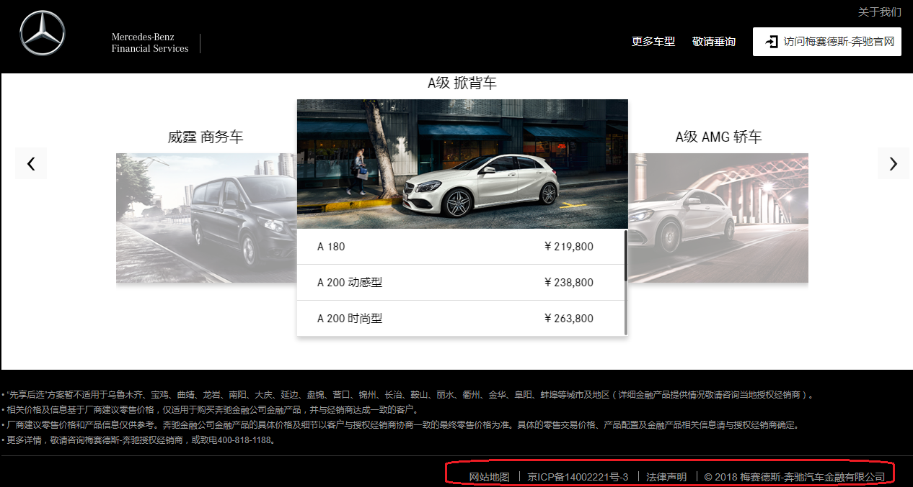
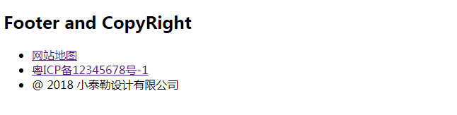
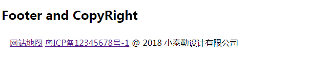
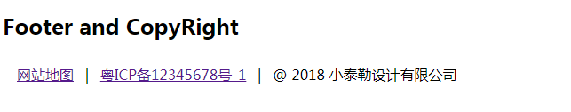
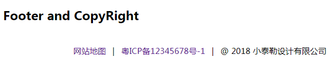

从今天起本博客将推出一些列针对小白的CSS实用小教程，与其说是教程，不如说的是学习和实战笔记。在CSS学习过程中发现不少简单实用又好玩的小技巧/小技能，忍不住想要记下来分享给大家。

本篇是CSS小白系列第一篇，制作Footer与CopyRight。Footer是一般网站均含有的，footer可以包括网站地图，icp备案号，法律声明以及copyright，如梅赛德斯-奔驰的网站。<!--more-->

<!--more-->

别看它就这么一行字，制作起来可是包含了不少CSS技术的哦。

__1.首先编写footer内容__
```html
<!DOCTYPE html>
<html>
<head>

</head>
<body>

<h2>Footer and CopyRight</h2>
<div class="footer-wrap">
    <ul class="legal-wrap">
        <li><a href="#" target="_blank">网站地图</a>
        <li><a href="http://www.miibeian.gov.cn" target="_blank">粤ICP备12345678号-1</a></li>
        <li>@ 2018 小泰勒设计有限公司</li>
    </ul>
</div>
</body>
</html>
```
效果如下图所示：



这里用了html列表标签ul和li。

你可能会说，怎么长得跟奔驰的footer一点都不像？别急，我们还没给html加上css样式呢。

__2.去掉列表每一行最前端的小点点，并且单行显示__
```css
ul.legal-wrap {
    padding: 8px 16px;
    list-style: none; /*去掉列表显示最前端的小点点*/
}
ul.legal-wrap li {
    display: inline; /*单行显示*/
    /*display的详细用法请参考https://www.w3schools.com/cssref/pr_class_display.asp*/
}
```


__3.加上分隔符"|"__
```css
ul.legal-wrap li+li:before { /*使用adjacent sibling selector在两个li之间加上分隔符。combinators的详细讲解见https://www.w3schools.com/Css/css_combinators.asp*/
    padding: 8px;
    color: black;
    content: "|\00a0"; /*这里的\00a0表示空格分隔符，见https://www.w3schools.com/cssref/css_entities.asp*/
}
```


这里用到adjacent sibling selector和pseduo :before 来实现在两个li之间加上分隔符。代码注释中均注有详细讲解的链接，感兴趣的小伙伴可以点进去学习一下。

__4.去掉链接的下划线，添加hover__
```css
ul.legal-wrap li a{
    text-decoration: none; /*去掉链接下划线*/
}
ul.legal-wrap li a:hover{ /*将鼠标放到链接上面，颜色会变成蓝色*/
    color: blue;
}
```

__5.实现右对齐/居中__
默认是左对齐的，我们可以根据实际需求实现右对齐或者居中
```css
/*右对齐*/
.footer-wrap{
    position:absolute;
    right:0px;
}

/*居中*/
.footer-wrap{
    margin: auto;
    width: 580px;
}
```
梅赛德斯网站的footer是右对齐的，我们这里也选择右对齐，效果如下：


以下是完整的代码：
```css
<!DOCTYPE html>
<html>
<head>
<style>
ul.legal-wrap {
    padding: 8px 16px;
    list-style: none; /*去掉列表显示最前端的小点点*/
    /*background-color: #eee;*/
}
ul.legal-wrap li {
    display: inline; /*单行显示*/
    /*display的详细用法请参考https://www.w3schools.com/cssref/pr_class_display.asp*/
}
ul.legal-wrap li+li:before { /*使用adjacent sibling selector在两个li之间加上分隔符。combinators的详细讲解见https://www.w3schools.com/Css/css_combinators.asp*/
    padding: 8px;
    color: black;
    content: "|\00a0"; /*这里的\00a0表示空格分隔符，见https://www.w3schools.com/cssref/css_entities.asp*/
}
ul.legal-wrap li a{
    text-decoration: none; /*去掉链接下划线*/
}

ul.legal-wrap li a:hover{ /*将鼠标放到链接上面，颜色会变成蓝色*/
    color: blue;
}
.footer-wrap{ /*右对齐*/
    position:absolute;
    right:0px;
}
</style>
</head>
<body>

<h2>Footer and CopyRight</h2>
<div class="footer-wrap">
    <ul class="legal-wrap">
        <li><a href="#" target="_blank">网站地图</a>
        <li><a href="http://www.miibeian.gov.cn" target="_blank">粤ICP备12345678号-1</a></li>
        <li>@ 2018 小泰勒设计有限公司</li>
    </ul>
</div>
</body>
</html>
```

参考链接：
[Breadcrumbs](https://www.w3schools.com/Css/css3_pagination.asp)
[display](https://www.w3schools.com/cssref/pr_class_display.asp)
[combinators](https://www.w3schools.com/Css/css_combinators.asp)
[css entities](https://www.w3schools.com/cssref/css_entities.asp)