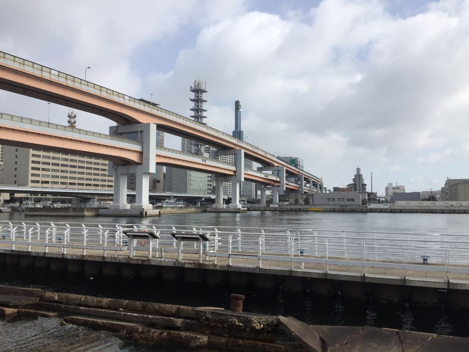
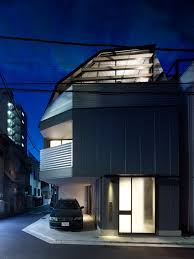
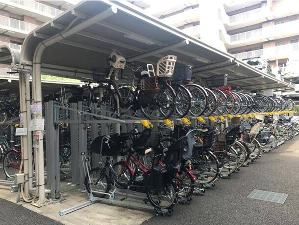

1月22日至2月5日，我有幸参与学院为期半个月的中日交流游学活动。从大阪到广岛，从福冈到京都，从神户到东京，游走了近乎半个日本，我亲身体会到日本文化，其中日本繁华而有序的交通给我留下较深的印象。

日本城市内部的主要交通方式为地铁、公交车、汽车以及自行车。主要以轨道交通引导城市发展的日本，城市轨道交通发达，仅东京都市圈内轨道交通总长度就达3000公里。日本城市道路普遍狭窄，交通流量很大，但道路拥堵现象较少，主要原因在于科学的交通组织与城市管理。<!--more-->

一是日本城市内部各交通方式行驶道路划分清晰，如轨道交通与公共汽车运输道路分离，行人道与自行车道分离。这样的管理方式有效地规范了各种交通流的行驶空间，最大限度减少了路口交叉点。

二是城市立体交通的建设。日本城市高速公路的主要形式是高架道路。由于日本城市土地利用紧张，尤其是东京这样的大都市，城市空间需要得到充分的利用，因此出现大量的立体交通建设。地上建设方面，在我们的考察过程中我们经常看见双层甚至三层的铁路高架桥，还看见不少正在建设的多层交通运输桥。地下建设方面，日本城市内部的地下铁和电车路线四通八达。

双层高架桥-福冈市下吴服町 图片来源：Taylor Liang摄影

双层高架桥-神户市波止场町 图片来源: Taylor Liang摄影

三是停车空间的利用。日本是众所周知的汽车生产大国，而且日本的汽车拥有量很大，几乎每个家庭拥有一台自家用车，然而我们走在大路上并没有看见像中国、美国那样在路边随处停车的现象，原因是日本采取多层停车的停车方式，日本设有专门的停车楼，小到一层两到三个停车位的机械停车楼，大到五到六层的大型停车楼。我们在城市高架桥地下也见有大量停车位。同时，日本有一个政策是，必须有车位才能购买车辆。我们在考察过程中发现，尽管日本大部分的楼房都比较小巧，但是地面层一般会设有用于放置私家车的停车房。除了汽车的停车管理，自行车也有设置双层停车场。

多层停车场 图片来源: Google图片多层停车场 图片来源: Google图片

私人住宅停车位 图片来源: Google图片

双层自行车停放点 图片来源: Google图片

四是交通信息控制管理。城市道路的信号灯控制主要分为两种，系统联网控制和自感应控制，系统联网控制的红绿灯长短时间是固定的系统预先设置好的，而自感应控制可以根据当前道路车流量、车辆运行状况等实时调整红绿灯时间长短以提高道路使用效率。

感应式交通信号灯 图片来源: Google图片

感应式交通信号灯 图片来源: Google图片

参考文献：
[1]关于日本道路交通管理工作的考察与思考
[2]日本以立体交通化解城市交通拥堵
[3]日本城市交通文化的现实启示
