---
title: MySQL安装
date: 2017-11-23 00:46:00
tags:
  - SQL
categories:
  - SQL
---
MySQL是世界上最流行的开源数据库，MySQL有很多不同的版本，包括企业版、集群版、标准版、经典版和社区版，其中MySQL社区版是我们普通开发者常用的版本。下面介绍MySQL社区版的安装。<!--more-->

下载地址[MySQL download](https://dev.mysql.com/downloads )，我用的是windows系统，因此下载mysql-installer-community-5.7.20.0.msi。下载完后双击打开安装包，进入到安装界面。

在Choosing a Setup Type界面可以选择多种安装方式，第一种Developer Default是安装所有MySQL开发所用到的工具，选这种方式安装起来会比较慢，而且我们也不需要里面的所有工具，因此选最后一种安装方式Custom，点击Next。

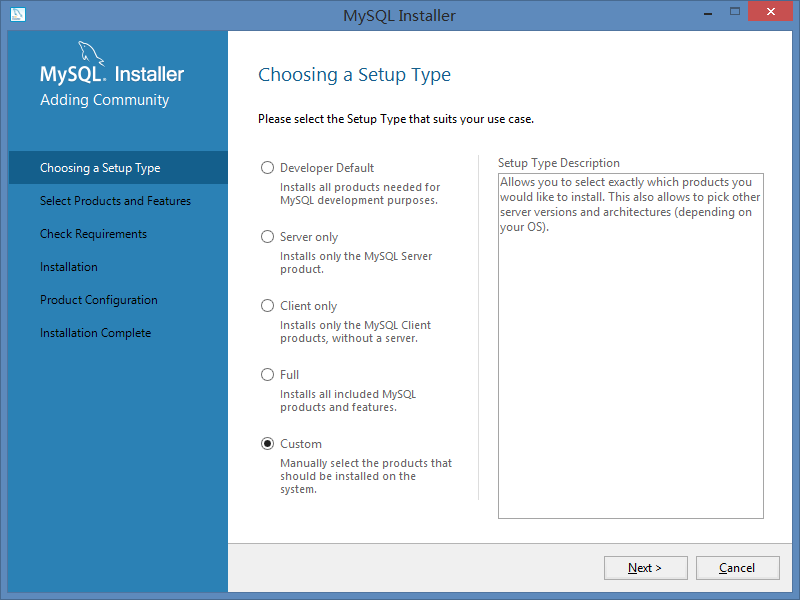

选择Custom安装方式后进入到Select Products and Features，可以按下图选择需要安装的products，选好后点Next。

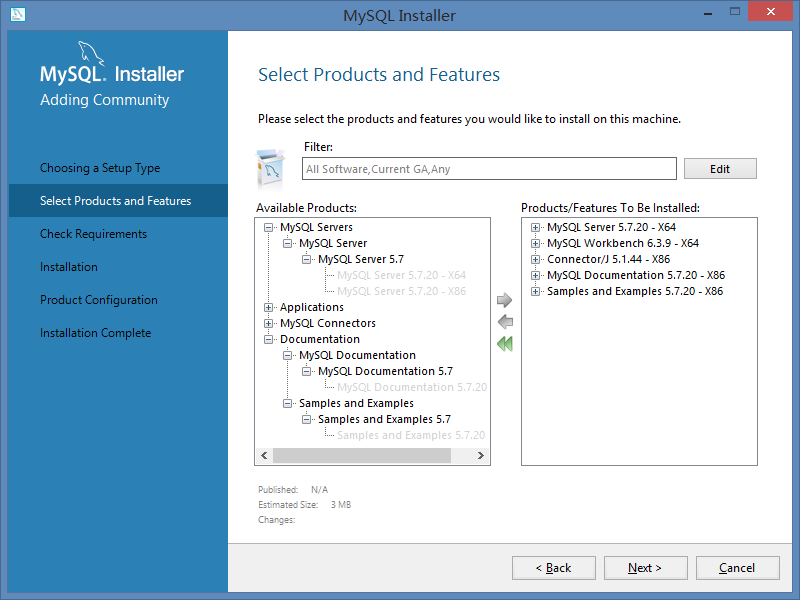

Check Requirements，点Execute，如果出现弹出需要安装东西的窗口，点Install就行，等所需的工具都安装好后，点击Next。

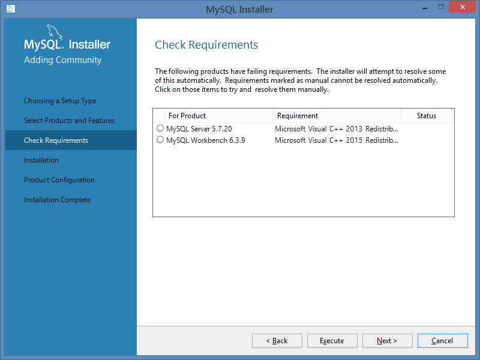

到了Installation页面，点Execute

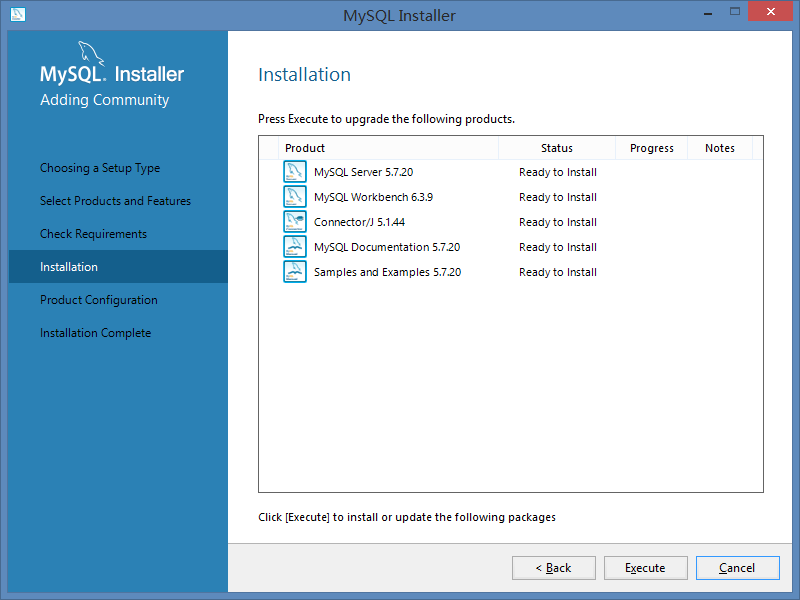

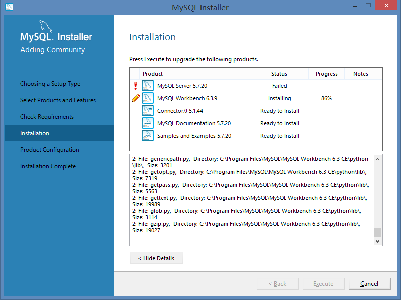

我安装MySQL server的时候遇到了问题，没法安装，说This application requires Visual Studio 2013 Redistributable，具体提示如下。在StackOverFlow上看到了相同的问题，回答说“It seems that MySQL is looking for VS 2013 Redistributable 32bit no matter in windows 32bit or 64bit”，于是去官网下载一个[32bit Visual C++ Redistributable Packages](https://www.microsoft.com/zh-CN/download/details.aspx?id=40784)问题就解决了。

一路Next后就到了配置MySQL服务器页面了，设置如下，Next。

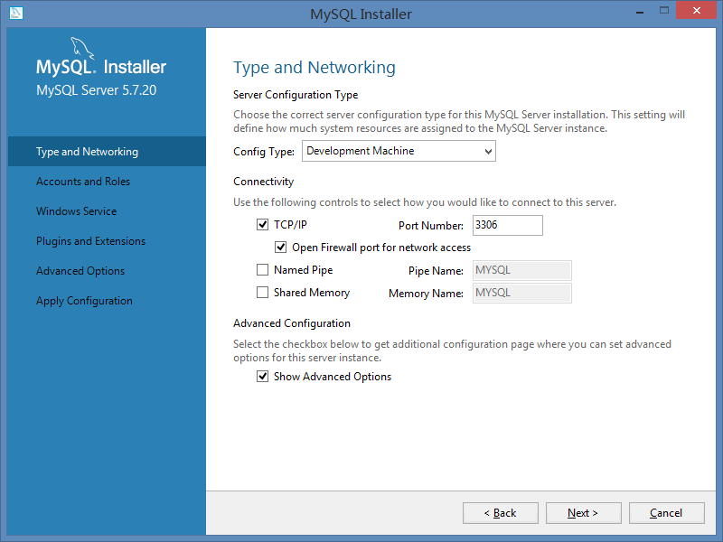

为Root Account设置password

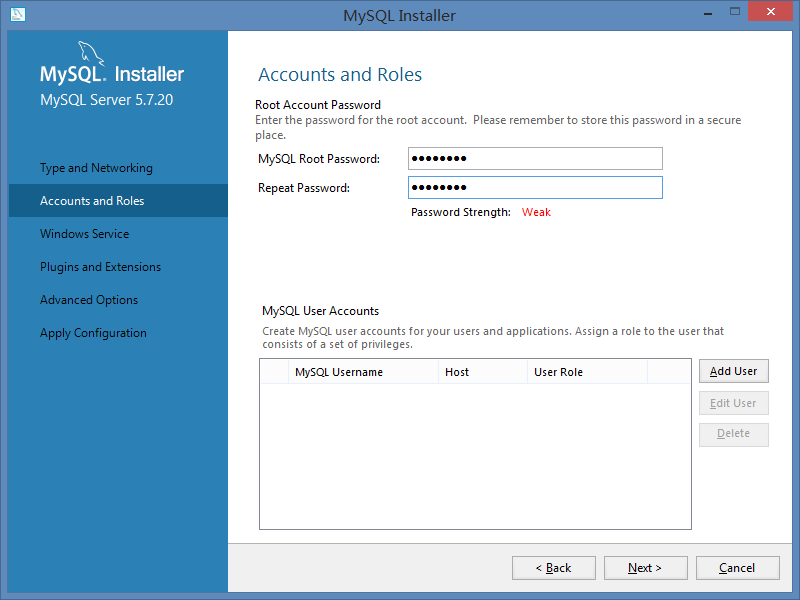

剩下的配置保持默认设置就行。
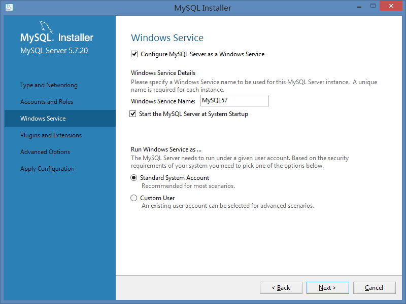
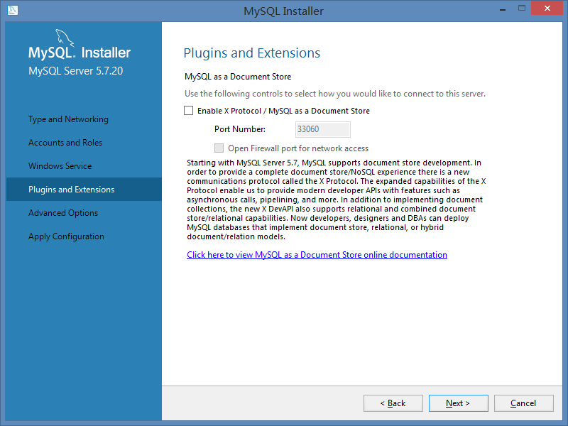
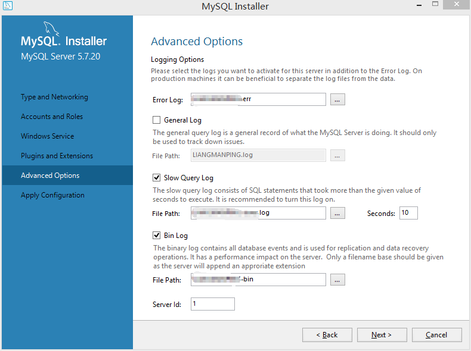

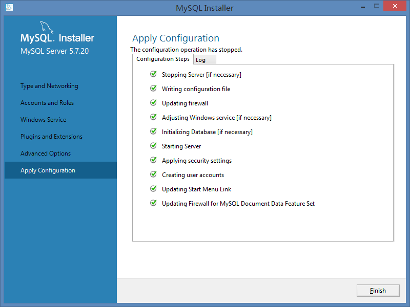
