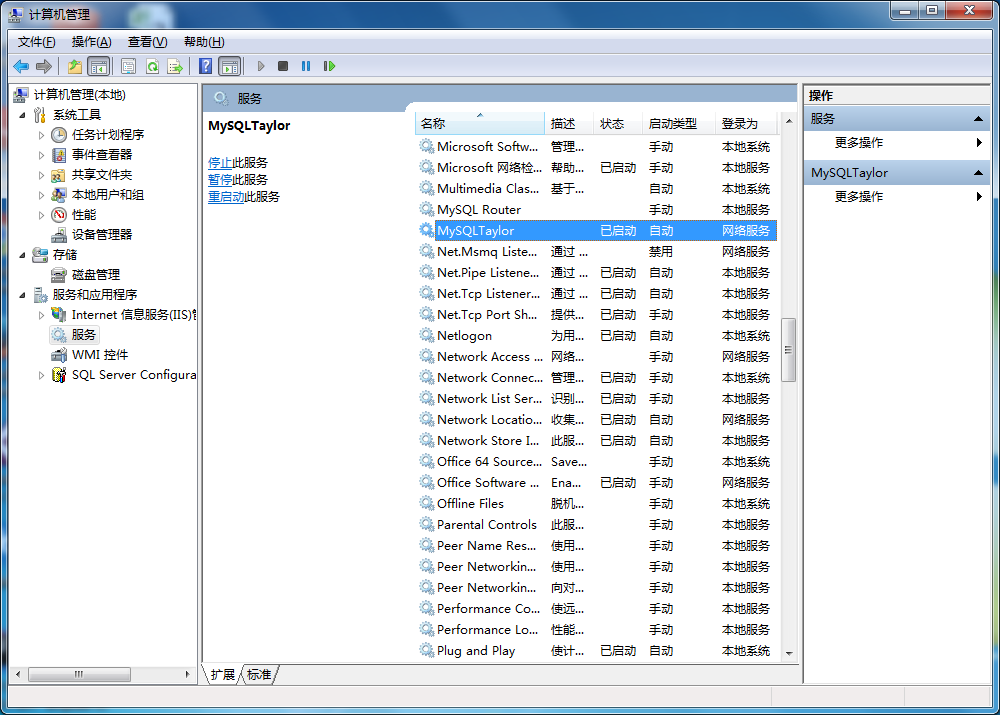
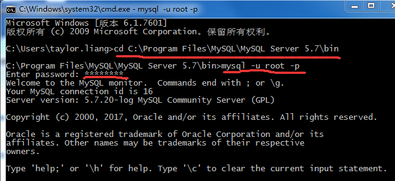
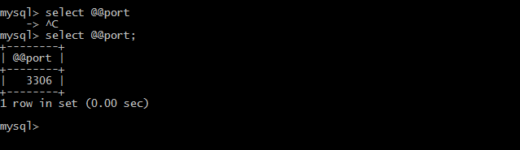
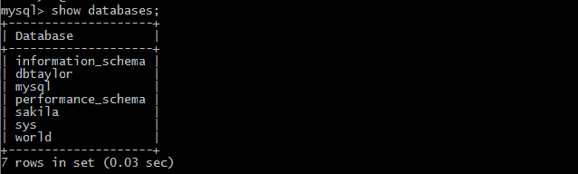
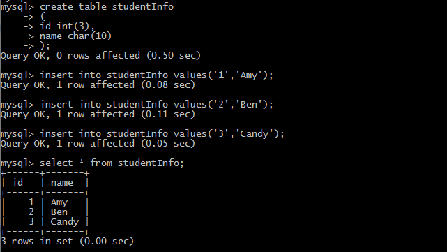

MySQL安装完成后就可以打开它来试试手了。

首先确保MySQL已启动服务：


启动windows命令行，`windows + R`，输入cmd，进入到windows command cmd，cd到MySQL Server的bin目录下：
```
cd C:\Program Files\MySQL\MySQL Server 5.7\bin
```
<!--more-->

# 打开MySQL的命令行模式
```
mysql -u root -p
```

输入密码后即可登录到MySQL Server。


## 查看服务器连接所用端口信息
```
select @@port;
```
注意，在MySQL中，每一条SQL语句结尾均需要分号“;”。


# 数据库管理
## 创建数据库
```
create database DBTaylor;
```

有时候为了避免重复创建，可以使用`if not exists`，具体命令行如下，
```
create database if not exists DBTaylor;
```

## 查看已有数据库
```
show databases;
```

dbtaylor就是刚才用命令行新建的数据库，其他的数据库如sys,world都是MySQL自带的sample数据库。

## 打开数据库
即指定使用某个数据库
```
use DBTaylor;
```

## 对数据表的操作
新建一个叫studentInfo的数据表,
```
create table studentInfo
(
id int(3),
name char(10)
);
```
向新建的studentInfo表插入数据，
```
insert into studentInfo values('1','Amy');
insert into studentInfo values('2','Ben');
insert into studentInfo values('3','Candy');
```
查看studentInfo表，
```
select * from studentInfo;
```
