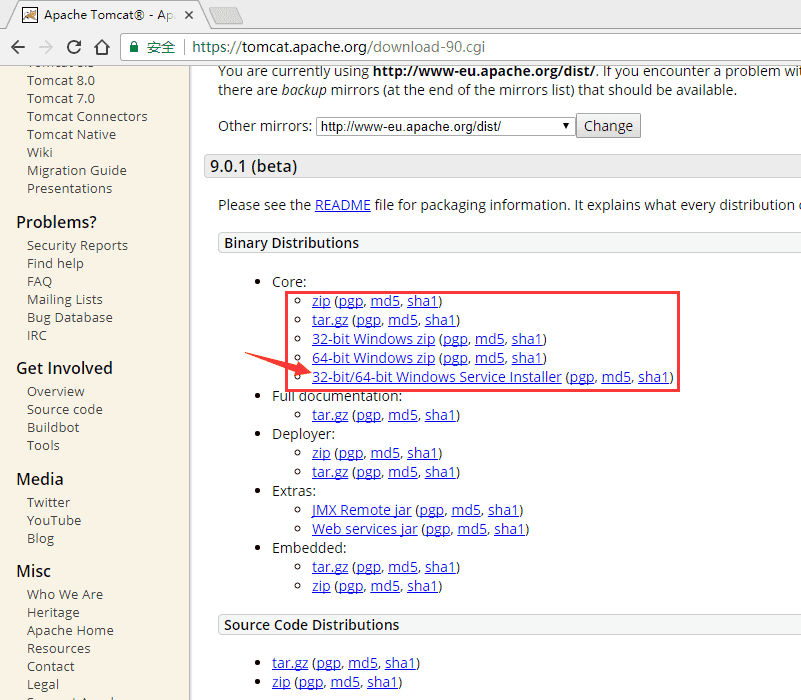
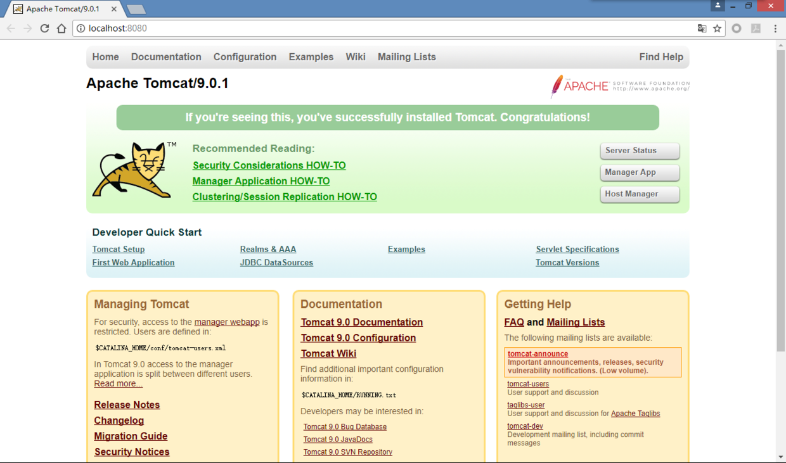

网站部署常用的有三种，Apache的Tomcat，Microsoft的IIS (Internet Information Services)，和IBM的WAS (WebSphere Application Server)。今天主要介绍第一种部署方式，Tomcat。
<!--more-->


Tomcat是一个免费的、开源的Servlet容器，它是Apache基金会的Jakarta项目中的一个核心项目，由Apache、Sun和其他一些公司及个人共同开发而成的。Tomcat技术先进、性能稳定，而且免费，因此深受Java开发者的喜爱，成为目前最流行的Web应用服务器。

Tomcat下载地址：https://tomcat.apache.org/download-90.cgi

有两种安装tomcat的方法，第一种是直接下载源文件压缩包，解压到制定目录之后再配置一下环境就可以了。第二种方法是下载exe安装包，按图形界面指导一步一步地安装。对于新手来说可以选择第二种方法。如图所示，下载32-bit/64-bit Windows Service Installer。



下载完成之后双击exe安装包即可安装，基本上是一路点Next就可以了。

Ps：在安装tomcat之前需要先安装JRE (Java Runtime Environment)

验证tomcat是否安装成功。打开浏览器，在地址栏输入http://localhost:8080，如果打开页面如下图所示，就说明已经安装成功啦。



下面我们来建立第一个jsp网页。找到tomcat安装目录，在webapps文件加下面新建一个文件夹，命名为“test”，在新建的test文件夹下面新建一个jsp文件，命名为“test.jsp”。


用文本文档或者notepad++打开新建是test.jsp，在里面添加如下代码：
```
<%@ page contentType="text/html; charset=gb2312" %>
<html>
<head>
	<title>First JSP page in Tomcat.</title>
</head>
<body>
	<h1>This is my first JSP page running in Tomcat.</h1>
	<h2>
		<%
		java.util.Date dt=new java.util.Date();
		int year=dt.getYear();
		year+=1900;
		int month=dt.getMonth();
		month+=1;
		int date=dt.getDate();
		int day=dt.getDay();
		out.print("Today is "+year);
		out.print("-"+month);
		out.print("-"+date+"  ");
		switch (day) {
                        case 0:
				out.print("Sunday");
				break;
			case 1:
				out.print("Monday");
				break;
			case 2:
				out.print("Tuesday");
				break;
			case 3:
				out.print("Wednesday");
				break;
			case 4:
				out.print("Thursday");
				break;
			case 5:
				out.print("Friday");
				break;
			case 6:
				out.print("Saturday");
				break;
			default:
				out.print("Error in day");
				break;
		}
		%>
	</h2>
</body>
</html>
```
保存代码文件，在浏览器地址栏中输入http://localhost:8080/test/test.jsp，页面显示效果如下：


好啦，现在你的第一个tomcat已经部署完毕啦，开心地玩去吧~