经常使用U盘的朋友可能会遇到这样的问题：U盘怎么无缘无故多了一些奇奇怪怪的快捷方式，而且还删除不了，或者删除之后下次插入U盘该快捷方式还在。如果出现这样的情况，你的U盘很可能中了快捷方式病毒，这是一种很常见的U盘病毒。今天教大家一个无需安装任何杀毒软件，从根源上清除这种快捷方式病毒的方法。<!--more-->

将U盘插入笔记本，发现U盘里有一个以U盘名称命名的快捷方式（如下图所示），点击该快捷方式，发现U盘的文件藏在了快捷方式里面了。

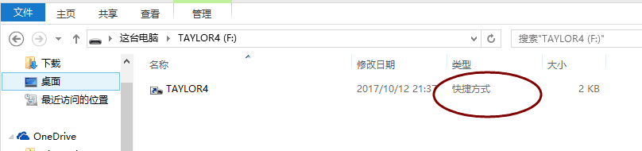

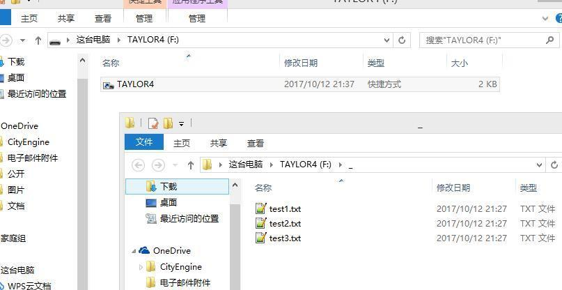

尝试把U盘文件暂存到笔记本的别的地方，删除该快捷方式，然后格式化U盘，拔出U盘重新插入到笔记本，咦怎么这个快捷方式还在？

这说明病毒的根源在笔记本，有可能是U盘在别的电脑使用过以后将病毒传染到你的笔记本电脑了，也有可能是你在网上下载在东西的时候不小心下载了含有病毒的文件。接下来我们来讲怎么找到病毒根源并且清除病毒。

### Step 1. 打开任务管理器
#### ctrl+alt+delete打开任务管理器，切换到“启动”

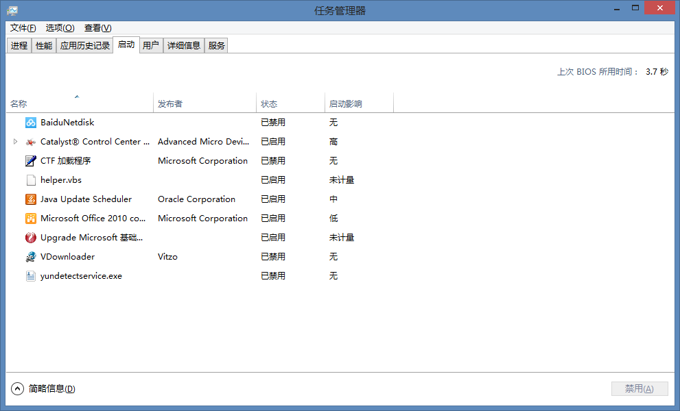

#### 识别哪个病毒
一般来说合法的程序都是有“发布者”描述的，如图中的“Java Update Scheduler”的发布者为"Oracle Corporation"，"Microsoft Office 2010 component"的发布者为"Microsoft Corporation"等，因此我们可以优先从发布者项为空的程序来找。图中的"BaiduNetdisk"和“yundetectservice.exe”都是百度云盘的，"Upgrade Microsoft基础类..."是我们学校的锐捷认证（用来连接校园网的），那么现在就可以锁定helper.vbs了。小tips：一般来说这种U盘病毒都是vbs病毒，因此你也可以直接锁定认为图中的helper.vbs就是U盘病毒。

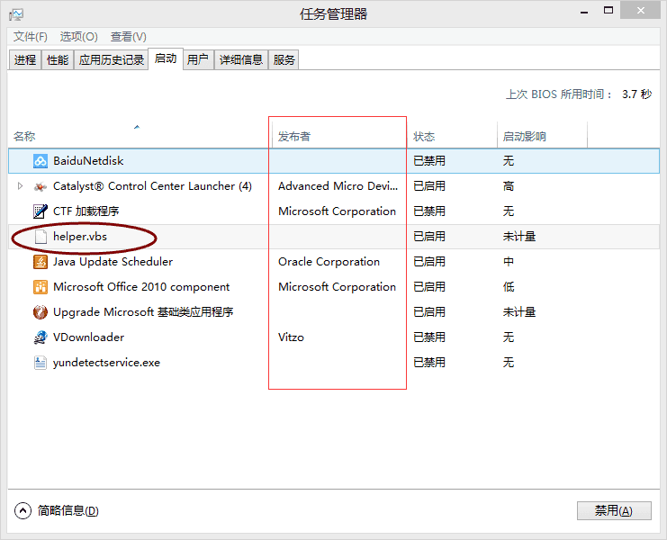

### Step 2. 找到病毒所在目录地址
 右键helper.vbs > 打开文件位置

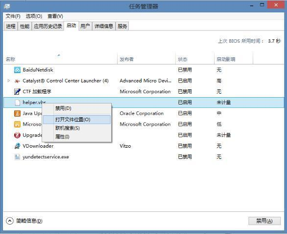

已进入到病毒所在目录的文件夹，我这里的路径是C:\Users\username\AppData\Roaming\WindowsServices，但是发现该文件夹为空（如下图所示），说明这里的病毒文件被隐藏显示了。

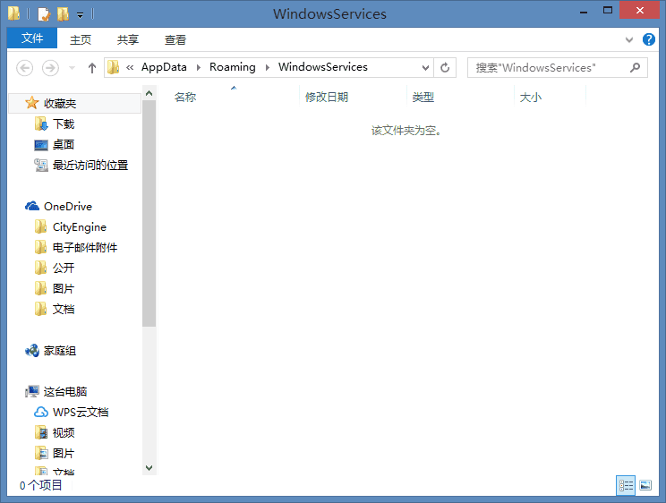

### Step 3. 显示隐藏文件
控制面板 > 查看方式选择“小图标” > 文件夹选项

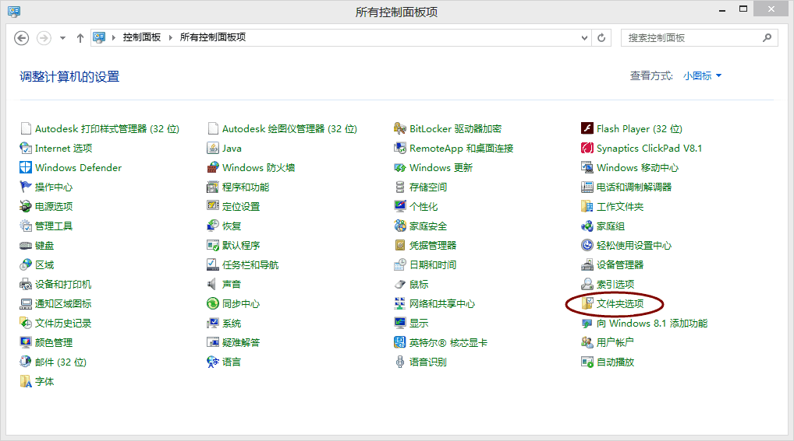

文件夹选项 > 查看
去掉图中的这几项隐藏项，并且选择"显示隐藏文件、文件夹和驱动器"（如图所示），设置好后点击确定。这时候再回到病毒所在目录文件夹，发现已经能看到病毒文件了。

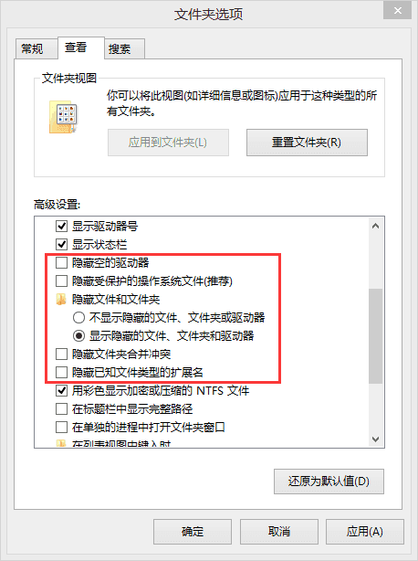

### Step 4. 删除病毒文件
将整个文件夹删掉（如图所示，删掉存放病毒文件的WindowsServices文件夹），但是弹出了错误提示框，提示文件夹正在使用无法删掉。

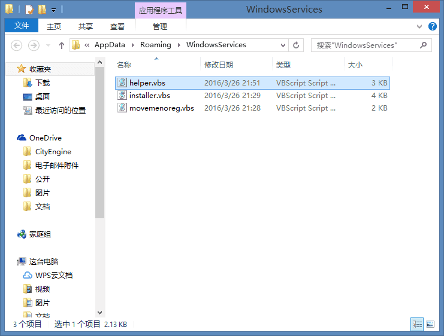

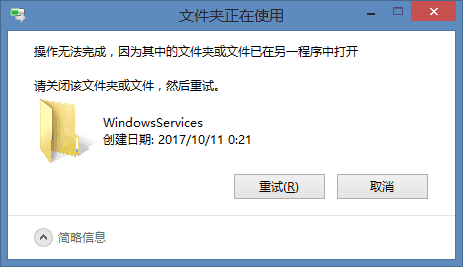

这时候回到任务管理器，切换到"启动"， 禁用helper.vbs，然后再切换到“详细信息”，找到wscript.exe，结束所有的wscript.exe任务，再回到病毒所在目录，就可以删去含有病毒文件的文件夹了。

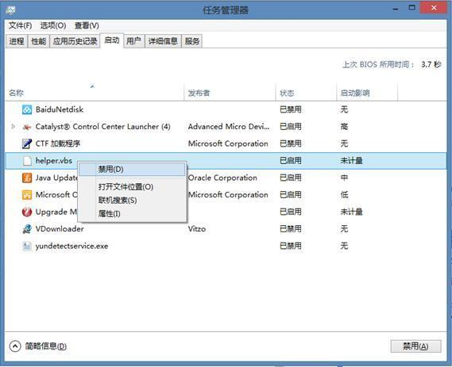

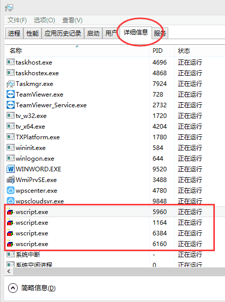

重新插入U盘，发现U盘已回复正常。

### 总结
总结一下清除U盘快捷方式的流程：
1. 打开任务管理器，识别病毒
2. 找到病毒所在目录地址
3. 在控制面板中设置显示隐藏文件
4. 删除病毒文件

---

PS: 以上纯属个人经验，仅供参考。