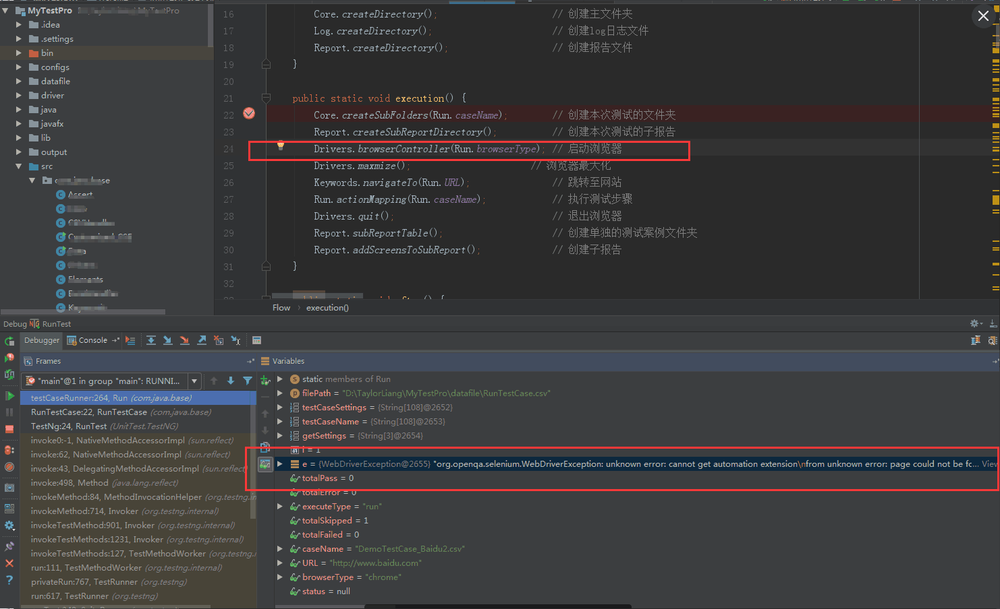
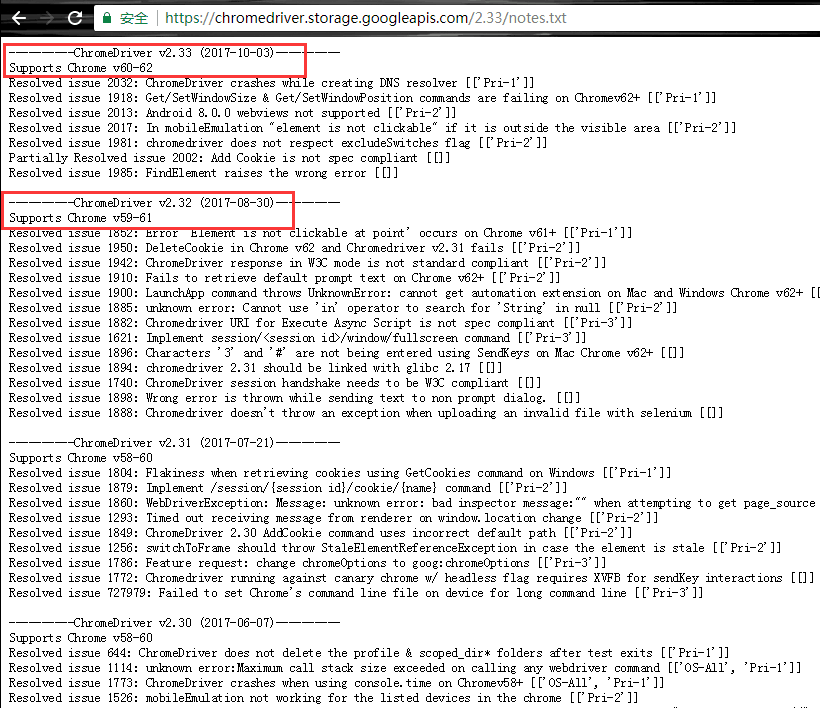

今天早上回到公司跑auto test，突然跑不动了，Selenium无法在Chrome浏览器上打开指定网页，但是直接手动在浏览器上打开网页是可以正常打开的，debug项目后发现报org.openqa.selenium.WebDriverException错误，详细错误提示如下所示<!--more-->



```
org.openqa.selenium.WebDriverException: unknown error: cannot get automation extension
from unknown error: page could not be found: chrome-extension://aapnijgdinlhnhlmodcfapnahmbfebeb/_generated_background_page.html
  (Session info: chrome=62.0.3202.94)
  (Driver info: chromedriver=2.29.461591 (62ebf098771772160f391d75e589dc567915b233),platform=Windows NT 6.1.7601 SP1 x86_64) (WARNING: The server did not provide any stacktrace information)
Command duration or timeout: 10.13 seconds
Build info: version: '3.0.1', revision: '1969d75', time: '2016-10-18 09:48:19 -0700'
System info: os.name: 'Windows 7', os.arch: 'amd64', os.version: '6.1', java.version: '1.8.0_121'
Driver info: org.openqa.selenium.chrome.ChromeDriver
Capabilities [{applicationCacheEnabled=false, rotatable=false, mobileEmulationEnabled=false, networkConnectionEnabled=false, chrome={chromedriverVersion=2.29.461591 (62ebf098771772160f391d75e589dc567915b233), userDataDir=C:\Users\TAYLOR~1.LIA\AppData\Local\Temp\scoped_dir7396_13176}, takesHeapSnapshot=true, pageLoadStrategy=normal, databaseEnabled=false, handlesAlerts=true, hasTouchScreen=false, version=62.0.3202.94, platform=XP, browserConnectionEnabled=false, nativeEvents=true, acceptSslCerts=true, locationContextEnabled=true, webStorageEnabled=true, browserName=chrome, takesScreenshot=true, javascriptEnabled=true, cssSelectorsEnabled=true, unexpectedAlertBehaviour=}]
Session ID: fddc45658ccd072059d891da10118e4e
```

查看[ChromeDriver notes](https://chromedriver.storage.googleapis.com/2.33/notes.txt)，发现是ChromeDriver和Chrome版本不对称的问题。从错误中的提示来看，我运行的项目中`Chrome = version 62.0, ChromeDriver = version 2.29`，然而`ChromeDriver = version 2.29` only supports Chrome v59-61，下载更新到最新版本的[ChromeDriver v2.33](https://chromedriver.storage.googleapis.com/index.html?path=2.33/)之后问题就解决了。

