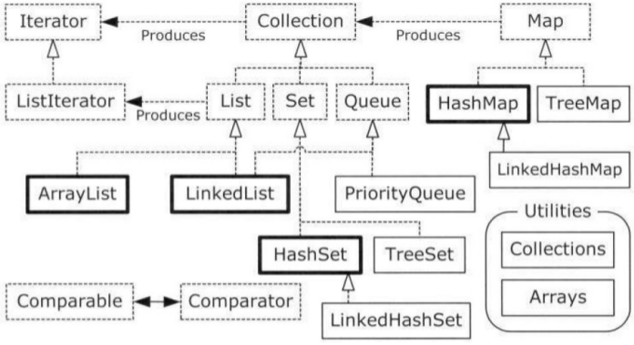

容器是java里面所包含的jar包内事先写好的程序，java容器有很多种，常见的有ArrayList，LinkedList,HashMap，TreeMap。容器的出现时为了方便程序员写代码使用，相当于制造汽车的时候有了组件，而不需要重复一些造轮子工作。<!--more-->下图是网上广为流传的Java容器分类图，图中画出了容器之间的继承关系。



推荐[浅谈Java 容器类（Set、List、Map）](https://test.zmblog.org/archives/289)这篇博文，个人觉得写得非常适合新手阅读，浅显易懂。

先来说最常用的ArrayList。ArrayList是一个实现了List接口的可变数组。当需要读入的数据个数事先未知时，可以用ArrayList的add方法来依次获取数据，然后通过toArray的方法将ArrayList传到数组里面。请看下面一段Demo代码。

```java
package javaDemo;

import java.util.ArrayList;  // 使用ArrayList需要先import java.tuil.ArrayList

public class test {

    public static String[] getList1(){
        String[] list = {"Amber","Ben","Candy","Daicy","Emma","George"};
        return list;
    }

    public static String[] getList2(){
        String[] list = {"Helen","Ivan","Jenny","Ken","Leila","Manny","Nancy","Penny"};
        return list;
    }

    public static void main(String[] args) {

        ArrayList<String> arrayList = new ArrayList<String>();
        String[] resultList = null;
        String[] unknownList = null;

        // =============== Reading unknownList1 ===============
        unknownList = getList1();  // get unknownList1
        for (int i=0; i<unknownList.length; i++){
            arrayList.add(unknownList[i]);
        }

        resultList = new String[arrayList.size()];
        arrayList.toArray(resultList);

        System.out.println(">>> Length of resultList: " + resultList.length);
        System.out.println(">>> Data in unknownList1: ");
        for (int i=0; i<resultList.length; i++){
            System.out.println(resultList[i]);
        }
        System.out.println("=========================================");

        // =============== Reading unknownList2 ===============
        unknownList = getList2();  // get unknownList2
        arrayList = new ArrayList<String>();
        resultList = null;
        for (int i=0; i<unknownList.length; i++){
            arrayList.add(unknownList[i]);
        }

        resultList = new String[arrayList.size()];
        arrayList.toArray(resultList);

        System.out.println(">>> Length of resultList: " + resultList.length);
		System.out.println(">>> Data in unknownList2: ");
        for (int i=0; i<resultList.length; i++){
            System.out.println(resultList[i]);
        }
        System.out.println("=========================================");
    }
}

```

运行结果显示如下：
