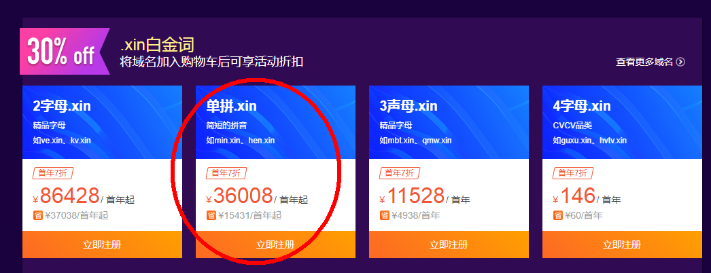

从建站者的角度来看，网站可以分为个人网站和企业网站。

个人为什么要建设网站？个人网站有点类似于个人博客，可以在自己的网站上发布日志，俗话有言，好记性不如烂笔头，个人认为将自己的工作和学习记录下来是一个好习惯。自己建设的个人网站可以根据自己的个人喜好修改样式和排版，还能自由地给网站添加功能，简直是热爱折腾的程序员的福音啊，DIY起来比CSDN、博客园、简书等寄托型博客好看多了。更重要的一点时，对于我们应届生以及刚出来社会工作时间不长的小伙伴来说，还能给我们的工作简历增添不少加分点，面试官一看你的简历就能大概知道你掌握什么技术。

企业为什么要建设网站呢？首先，企业建设网站是为了展示企业形象，强调自己的企业实力，现在找工作的人都知道要先百度一下/google一下，看看这个公司是否有官方网站，是否是骗子公司，如果没有，你觉得人家敢相信你吗？客户敢信任你吗？<!--more-->

# 网站构成
网站主要有三个部分组成，域名+服务器+网站设计制作+后期维护和更新。

## 域名
域名，也就是网址，需要单独购买和备案，域名价格高低不等，便宜有时候阿里云搞活动1块钱首年的域名也有，身为穷学生的我们可以多留意阿里云腾讯云的云解析优惠活动。域名一般都是首年比较便宜，过了第一年想要续费价格就开始飙升了。贵的域名，价格可以高到几万甚至几十万。

## 服务器
服务器，用于存储发布的代码文件、文字、图片、视频等资料，个人建站如果嫌购买服务器太贵可以将项目文件寄存到github或者国内的coding.net，这样做的缺点是，你的代码是开源的，别人可以轻松地获取你的网站的源代码。企业建站可以说是必须购买服务器的，这是一笔固定开销，逃不了的。小型公司做一个展示性的官方网站，用到的存储空间应该不需要太大，买个1G的服务器就绰绰有余了。

## 网站设计制作。
网站制作可大致分为两类，网页版和后台版。

网页版，也就是多个静态html加上js交互构成的网站，用于展示企业文化、产品、服务等相关信息，具体包括文字介绍、图片展示、地理位置、官方网址、团队成员、联系方式等信息。一个刚起步或者规模较小的公司，做一个这样的静态网站就足够了，开发人员用心做的话完全可以做得非常好看的。这样的网站优点是开发成本较低，周期较短，但是不易后期维护和内容更新，如果以后需要改动网站或者更新内容还需要麻烦开发者来亲自操刀。

后台版，也就是可以实现前后端数据交互的网站，通常会涉及到数据库，逻辑较为复杂，开发成本较高，开发周期长，如果做得好的话后期维护甚至不需要程序员更改代码文件，相当于一个独立的网站系统（想想都觉得工作量超级大哈哈）。

## 后期维护与更新
网站不是一次性制作完就ok了，你还得考虑后边的维护、升级。

# 建站步骤
1. 明确企业网站建设的目的，理解企业为什么要建立这个网站，需要这个网站实现怎么样的一个功能或价值，比如：宣传企业形象、推广企业产品等。

2. 域名规划，也就是给网站设计一个域名，域名一般与公司名称有直接关系，简短、易于记忆。查询和购买域名。

3. 服务器购买。

4. 网站设计。主题风格，具体需要实现什么功能。

5. 网站架构。有点像书本/论文的目录

6. 网站维护。SEO、网站更新等。

# What the company may want to know about:
1. Why do the company need a official website

2. How to build a website technically.
	网站建设需要：域名、服务器/虚拟空间、具体代码编写、后期维护和更新等
	
3. How much
	Depends on the kind of website you need. 
	静态网站（不带后台的），适用于作为简单的产品信息展示
	网站系统（带后台的），涉及数据库管理。
	
4. Time cost

# What the website builder need to know:
1. 什么行业什么类型的公司

2. 网站的主要功能（展示、推销等）

3. 主要面向的人群

4. 网站的具体功能

5. 网站风格

# 公司需要提供给网站建设人员的
公司需要提供给网站建设人员的东西：具体需要展示的内容，如文字、图片等。

# 一般的公司官网架构
网站首页：关于公司的简介、团队简介、新闻中心等

产品介绍：具体的产品展示

联系我们：联系方式，地址，电话，传真，email等联系方式

# 软件生命周期
1. 需求分析

2. 产品设计

3. 具体实现

4. 网站维护与后期更新

-----------------