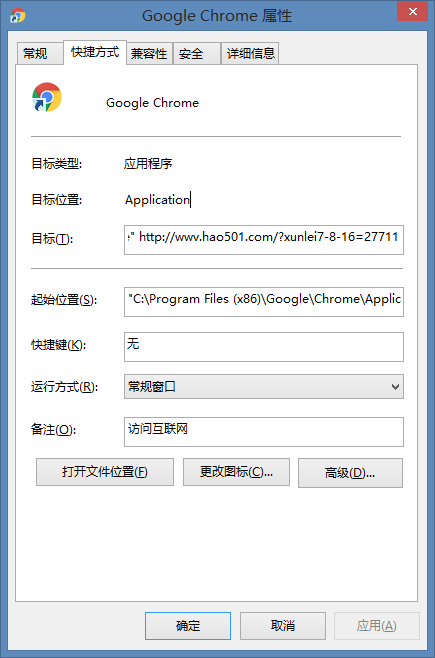

双击桌面chrome图标，打开浏览器后发现是hao.360页面，可是我的chrome浏览器启动页明明设置的是google页面啊，于是去浏览器里面设置，将开启页面和主页均设为www.google.com后，重新打开chrome还是360的页面，好恶心！右击打开该图标的属性，发现目标栏地址如下：<!--more-->
```
"C:\Program Files (x86)\Google\Chrome\Application\chrome.exe" http://wwv.hao501.com/?xunlei7-8-16=27711
```

发现chrome.exe后面被加上了开启页地址，该地址就是那个恶心的360的主页，从这个地址可以看出，是迅雷搞的鬼，可能是使用迅雷下载软件的过程中不小心点了什么东西造成的。不知道这样的手段是否违反软件规范，这样的行为真的很让人觉得反感。删去目标栏中多余的`http://wwv.hao501.com/?xunlei7-8-16=27711`后重新打开chrome，果然重新恢复了干净简洁的google页面。