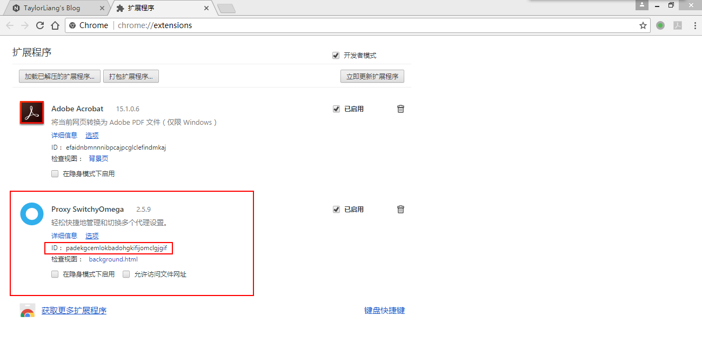
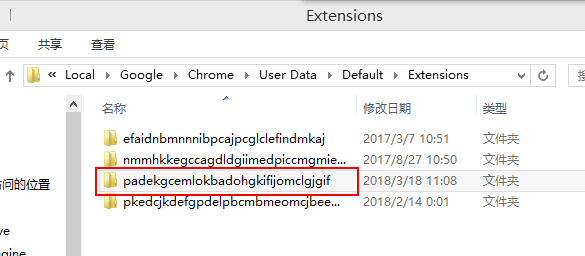
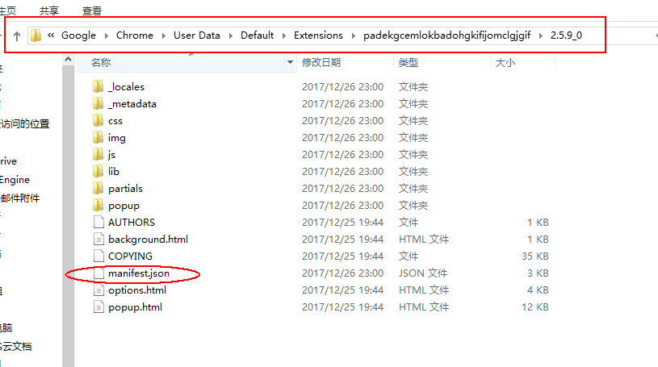
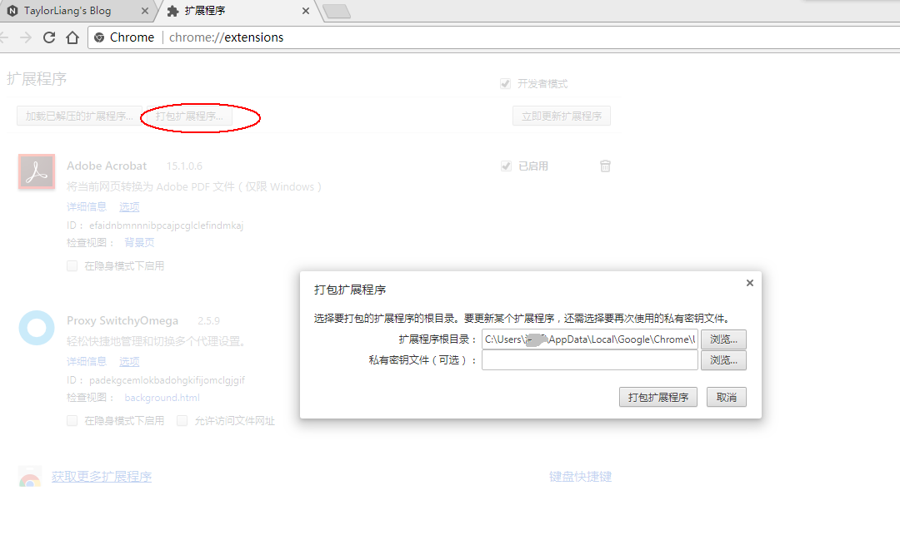
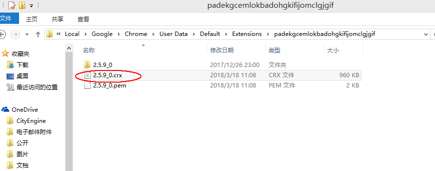

朋友想要给chrome安装某个扩展程序，但是没有vpn无法下载安装该扩展程序（如SwitchyOmega），这时你可以将已安装在你的chrome的该扩展程序导出给你朋友。那么问题来了，如何导出Chrome扩展程序呢？本文以导出Proxy SwitchyOmega为例。<!--more-->

# Step1 找到需要导出的扩展程序ID
在__更多工具->扩展程序__中打开查看浏览器中的扩展程序，找到ID号。

# Step2 找到该扩展程序的存放路径
在Windows中的存放路径为`C:\Users\用户名\AppData\Local\Google\Chrome\User Data\Default\Extensions`，在该路径下找到名称与ID号一致的文件夹，一直进到含有`manifest.json`文件这一层，将路径复制下来。

# Step3 导出扩展程序
回到浏览器扩展程序页面，点击左上角的“打包扩展程序...”，将刚才复制的路径粘贴到“扩展程序根目录”处，点击“打包扩展程序”，即可完成导出。导出后的.crx文件在刚才复制过来的路径的上一级。

