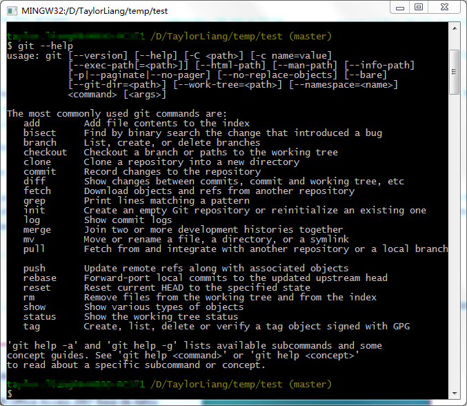

---
title: Git常用命令行及github使用
date: 2017-10-30 22:38:31
tags:
  git
categories:
  技术
---

Git号称是目前世界上最先进的分布式版本控制系统，没有之一。<!--more-->
```
## git初始化配置
git config --global user.name "your name" //设置用户名
git config --global user.email you@domain.example.com //设置用户邮箱
git config --list //查看配置list

## 添加ssh-keygen
// 先查看是否已有的SSH keys:
ls -al ~/.ssh
//  如果有，cd到SSH keys的目录
cd ~/.ssh
// 获取当前路径
pwd
// 如果没有，则新建ssh
ssh-keygen -t rsa -C "youremail@domain.com"

## 把本地工作区某个目录变成git可以管理仓库
git init //可以发现当前目录下多了一个.git的目录

## 初次连接Github的某个repository
git remote add origin git@github.com:Liangmp/Liangmp.github.io.git
//请把后面的仓库地址换成你自己的GitHub仓库地址
// 添加后，远程库的名字就是origin，这是Git默认的叫法，也可以改成别的，但是origin这个名字一看就知道是远程库。

## 将代码上传到github
git add . //将所有修改过的工作文件提交暂存区。如果不想add所有，可以用下面一行代码
git add <filename> //将某个指定的文件提交暂存区 
git commit -m "commit message" //提交修改
git push -u origin master //将缓存区的代码push到git的master分支
```

## 克隆某个代码仓库
```
git clone git@github.com:userName/repositoryName.git
```

## 关联新的远成仓库
```
git remote rm origin  // 取消当前的关联
git remote add origin git@github.com:userName/anotherReposity.git // 关联新的远程仓库
```

你还可以通过`git --help`查看常用的git命令行。



推荐阅读：
- [廖雪峰的git教程](https://www.liaoxuefeng.com/wiki/0013739516305929606dd18361248578c67b8067c8c017b000)
- [天梯梦-git常用命令整理](http://justcoding.iteye.com/blog/1830388)