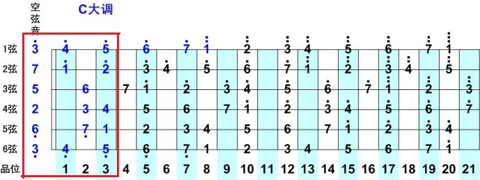
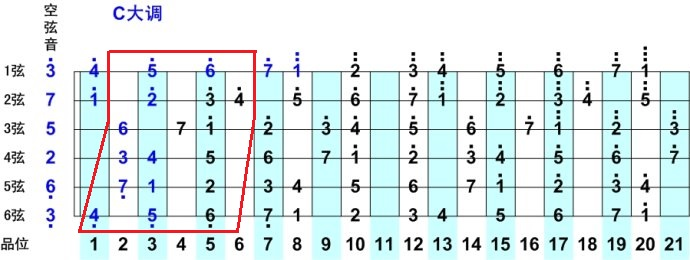
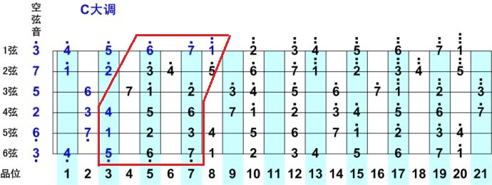
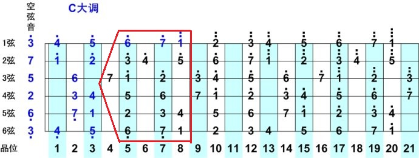
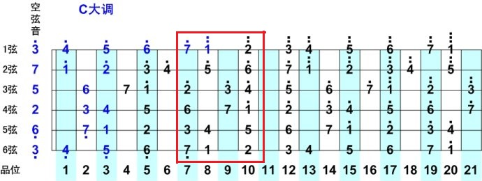
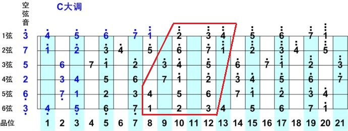
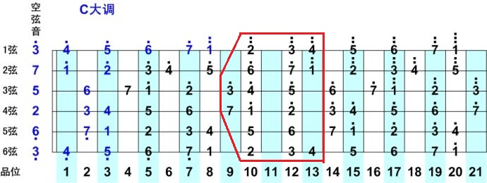
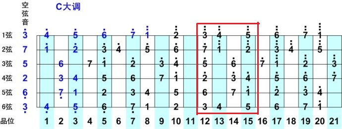

吉他有三要素：旋律，和声，节奏。

旋律，通俗的说，就是我们平时不由自主地哼一首自己熟悉的歌的一连串的调调。

和声，也就是弹吉他的人常说的和弦，由不同的音阶有规律地组合而成。比如，C和弦由Do，Me，So三个音阶组成，根音在Do；F和弦由Fa，La，Do三个音组成，根音在Fa。<!--more-->

节奏，也可以理解为音乐的快慢，拍子，一般来说我们都可以跟着一首歌“哒，哒，哒，哒……”地数拍子，有时候听一些电音（如Alan Walker的Fade或者Faded）会忍不住跟着抖腿，这都是音乐的节奏。

我们平时玩吉他弹唱，很多时候弹的是和声（和弦），唱的是旋律，有些朋友还喜欢加上节拍器，那么吉他这三要素就刚好都用上啦。所有的歌，无非都是在旋律、和声和节奏这三样里面变化的。

我们先从旋律入手，说到旋律，必须先说音阶。为什么说音阶对于吉他学习来说很重要呢？对于钢琴或者键盘（即电子琴），音阶是非常容易理解的，因为在钢琴或者键盘里面，所有音都是固定的，中央Do永远只有一个，而在吉他里面却可以有很多个。最早的流行音乐是黑人发明的，他们不懂什么乐理，但是他们知道吉他的音阶呀，只要知道音阶就可以开心地玩起音乐来了。

音阶练习，首先是肌肉记忆，也就是习惯记忆，按着音节顺序照着各个把位的音阶图来练习，练熟之后可以不看音阶图，直接靠肌肉记忆来弹音阶。等肌肉记忆记熟了，就会进入大脑记忆阶段，可以在吉他键盘上任意找到各个音阶的位置。

C大调全把位音阶图

第一把位，Me把位，也叫空弦把位音阶，是吉他入门最基础的必须掌握的把位音阶。

第二把位，Fa把位

第三把位，So把位

第四把位，La把位

第五把位，Si把位

第六把位，Do把位

第七把位，Re把位

第八把位，Me高把位
