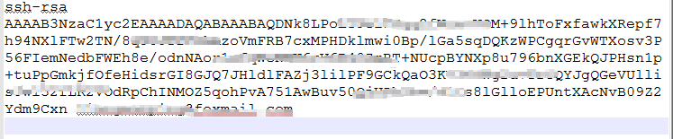
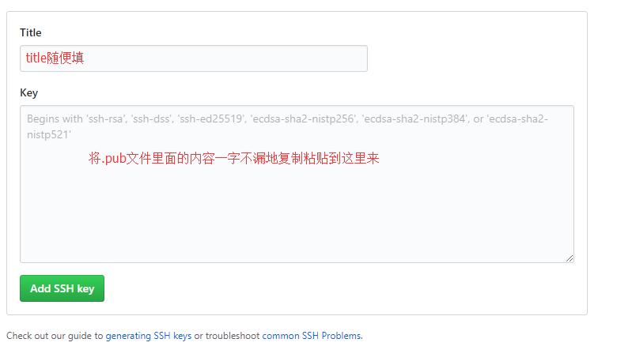

这是一篇用Github+Hexo搭建个人博客网站的经验分享。<!--more-->

## Git的安装与配置
git是目前最先进的版本控制工具，很多优秀著名的软件都是用git来管理的。

### Git的安装
如果你的电脑没有git，那么首先需要安装git。git一开始是写给Linux系统的，因为很多做开发的程序员都喜欢用Linux，后来Windows开发者越来越多，于是出现了git-for-windows，下载地址请点击[这里](https://git-for-windows.github.io/)，如果下载太慢，可以换个地方到[这里](https://github.com/waylau/git-for-win)下载。下载完之后双击.exe进行安装，安装过程基本上一路点next就行。如果安装过程中忘记了设置在桌面放置git快捷方式，等安装好后回到安装路径文件夹里面创建git bash快捷方式就可以了。


### Git的基本配置
安装完成后，在D盘（在其他盘也行）新建一个文件夹，命名为“git”（命名随意，看你喜欢），然后进入该文件，在空白处右击鼠标，发现多了“git GUI here”和“git bash here”两个选项，选“git bash here”。
输入`git -version`可以查看当前git版本号。
设置user name，输入命令行:
`git config --global user.name "taylorliang"`
将taylorliang改为你的名字
设置user email：
`git config --global user.email taylorliang@domain.com`
需要将taylor@domain.com改为你的邮箱地址
查看修改：
`git config --list`
可以看到，user.name和user.email已经设置为我们想要的值了。

在git bash输入`pwd`，找到pwd后显示的路径，进去找到.gitconfig文件，将它复制到刚才新建的文件夹D:\git里面

## node.js的安装与配置
Hexo是一个用JavaScript写的开源静态博客框架，node.js是JavaScript的运行环境，因此我们需要下载node.js，下载地址请点击这里[这里](http://nodejs.cn/download/)，根据自己的操作系统下载安装包，我的是win64，因此可以选windows.msi64位，安装时也是基本一路next即可。

打开git bash，输入`node -v`，如果能显示版本号，说明node.js已成功安装。

## Hexo的安装与配置
在D:\git里面新建一个文件夹，命名为“blog”，命名为其他也没关系，你喜欢就行。右键git bash here，然后输入下面的命令行安装hexo,
`npm install -g hexo-cli`
如果安装太慢或者安装不成功，可以先安装淘宝npm来代替npm，具体命令行如下，
`npm install -g cnpm --registry=https://registry.np.taobao.org`
然后继续输入命令行：
`hexo init`
安装依赖包：
`npm install`
或者输入`cnpm install`
完成上述步骤之后你的文件夹会多了node_modules，scaffolds，source,themes这几个文件夹（如果我没记错的话），一些.json文件和其他的文件，大致如下图所示。

到了这一步，你已经完成Hexo的本地搭建了，在blog文件夹he下git bash依次输入以下命令行，
```
hexo generate
hexo server
```
待git bash显示`INFO Hexo is running at http://localhost:4000/. Press Ctrl+C to stop`时，打开浏览器，在地址栏输入http://localhost:4000/ ，如果浏览器显示如下画面，就说明你已经成功搭建好了，先找个角落开心一小会儿去吧~

## Github的设置
开心完之后可以回来继续工作了，上述步骤只是在本地上部署好了，但是并没有部署到网上，也就是说目前就只有你能看见，别人还是看不见的，需要将本地文件和Github关联起来。
### 创建ssh
github支持https和ssh两种方式来对代码仓库进行操作，https每一次操作都需要输入用户名和密码，比较麻烦，而使用ssh公钥来进行授权以后就不需要如此频繁地输入用户名密码了，因此建议添加ssh。
首先先确认一下是否已经有一个公钥，.ssh 公钥默认储存在账户的主目录下的~/.ssh目录。进去看看,命令行输入为：
```
cd ~/.ssh
ls
```

如果没有，则创建一个ssh，在你喜欢的目录下邮件git bash输入：
`ssh-keygen -t rsa -C "taylorliang@example.com"`
taylorliang@example.com为邮箱地址，请改成你自己的。输入完上述命令行之后一路回车即可。如果你看见一张长得很像下面的图的图形出现，就说明ssh已经创建好了。

会发现文件夹里面多了一个.ssh文件夹，点击进去，打开id_rsa.pub，里面大概长这个样子：

### 在Github上添加ssh
Settings -> SSH and GPG keys -> New SSH key -> 填写Title -> 一字不漏地复制粘贴到Key这里来



在blog文件夹下git bash，输入如下命令行，按回车，中间问(yes/no)的时候输入yes。
`ssh -T git@github.com`

### 创建repository仓库
登录Github，点击右上角的+号小图标，选New repository

Repository name填username.github.io，注意这里的username要改成你自己的github账号名，然后点击页面下方的Create repository。


## 博客的简单设置
注意到blog文件夹内有一个名叫_config.yml的文件，用notepad++打开它（也可以用其他文本编辑器打开），下面我们来进行一些简单的设置。
### 设置hexo静态网页文件的代码仓库
找到deploy这一块代码，然后将下面的代码复制进去，保存修改。
```
deploy:
  type: git
  repository:
    git@github.com:Liangmp/Liangmp.github.io.git
  branch: master
```
注意：
repository下面一行的地址改成你自己的代码仓库地址，你的代码仓库地址的查找方法参考下图：


### 修改title,description等
如图所示，根据你个人喜好来修改。

修改后效果如下图所示

其中，language: zh-Hans表示博客使用简体中文，avatar是头像设置，头像的更换方法是在sourc文件夹内新建文件夹命名为images，在里面放置你想要显示的头像图片。

## 博客管理及博文更新
保存好所有修改，在blog文件夹下git bash输入如下代码：
```
hexo generate //生成静态网页文件，也可以简写成 hexo g
hexo server   //在本地浏览器上预览，也可以简写成 hexo s
hexo deploy   //部署到远程仓库上，也可以简写成 hexo d
```
此时可以尝试在浏览器中输入https://yourname.github.io ，如果能出现hexo画面，就说明已成功绑定Github远程仓库，github+hexo的博客搭建已经基本完成，剩下的就得靠你自己去不断探索啦，大胆地按照你的个人喜好DIY你的个人博客吧。

## Next主题的安装和配置
Next是一种优雅且好用的Hexo主题，在[Github](https://github.com/iissnan/hexo-theme-next)上获得了大量的star和folk，目前在网上见到个人博客大多数都采用了next。

这一part的安装和使用说明请移步到下一篇博文。