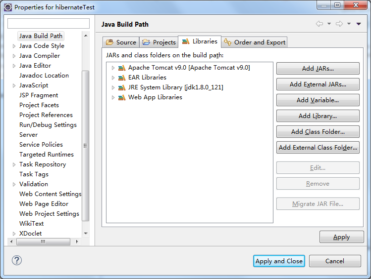

Hibernate是一个ORM框架，它对JDBC进行了轻量级的封装。通过使用Hibernate框架，开发人员可以以面向对象的思维方式来操作数据库。<!--more-->

# ORM
ORM(Object-Relation Map, 对象关系映射)是一种为了解决面向对象编程过程中，程序与关系数据库交互而提出来的技术。ORM的原理是将对象与表、对象的属性与表的字段分别建立映射关系。例如，Java程序中有User这一对象，它含有username和password两个属性；数据库中有一个User表，该表含有username和password两个字段。通过“O-R映射”可以自由地通过操作对象来操作数据，而不用考虑数据在数据库中的存取问题。比较流行的ORM框架有：Hibernate, iBATIS/Mybatis, JPOX, Apache Torque, TopLink/EclipsLink等。本文主要介绍Hibernate的配置和使用。

# Hibernate下载
Hibernate资源包下载地址：http://hibernate.org/orm/releases/

- documentation: 存放Hibernate使用手册。
- lib: 存放Hibernate所有的运行库文件资源包，每一种资源包都存放在独立的子文件夹中，其中required子文件夹中的jar包是我们开发Hibernate项目所需的jar包。
- project: 存放Hibernate框架的源代码文件。
- changelog.txt: 改文件记录了所有Hibernate版本更新所做的变更说明。
- hibernate_logo.gif: Hibernate的logo。
- lgpl.txt: 使用hibernate的授权说明。

# Hibernate配置和使用
## 新建User Library
为了今后更多的项目都能快速引用Hibernate的依赖库，我们可以在Eclipse中新建一个User Library，将Hibernate开发必须的jar包都加进去。
打开Eclipse JEE，执行以下步骤：
Window->Preferences->在左上方的搜索框中输入User->选择 Java | Build Path 节点下的User Library -> 点击窗口右侧的New按钮

在New User Library对话框中输入library name，勾选System library(added to the boot class path)

点击确定，回到Preferences对话框，点击右侧的Add External JARs...按钮，选择Hibernate的lib/required子文件夹中的所有JAR文件，Apply and Close，完成User Library创建。

## 在项目中引用User Library
创建好Hibernate的User Library后就可以在任意项目中引入Hibernate的依赖包了。
File->New->Dynamic Web Project

右击项目名hibernateTest -> Build Path -> Configure Build Path...
切换到Libraries选项卡，可以看到如下图所示的信息。

点击右侧的Add Library，选择刚才新建的User Library
 

## hibernate的使用

**_未完待续。。。_**