今天接到了一个任务，给我们team负责的目前快要上线项目做接口测试，需要写unit test实现接口代码逻辑的全覆盖，这个项目是用.net写的，而我的工作电脑之前只安装了tomcat，tomcat是用来运行java程序的，.net只能用iis来跑，毕竟他们都是微软的产品，微软就喜欢搞这种捆绑制度（顺便吐槽一下，此处省略两千字），借此机会写一篇iis安装部署的博客，权当实习日志。

网站部署常用的有三种，[前面的一篇博客](https://liangmp.github.io/2017/10/24/Tomcat/)已经讲了tomcat的部署，今天我们来讲IIS的部署。

IIS是Internet Information Services的简称，是微软公司创建的具有可扩展性的物联网服务。iis是内置在Windows系统里面的，因此安装起来非常简单，如微软操作系统一样，都有图形界面，所有步骤都是傻瓜式的点点点。下面就来配上截图讲一下安装过程。<!--more-->

## Step1 打开控制面板
右击桌面上的计算机图标，选择“属性”。
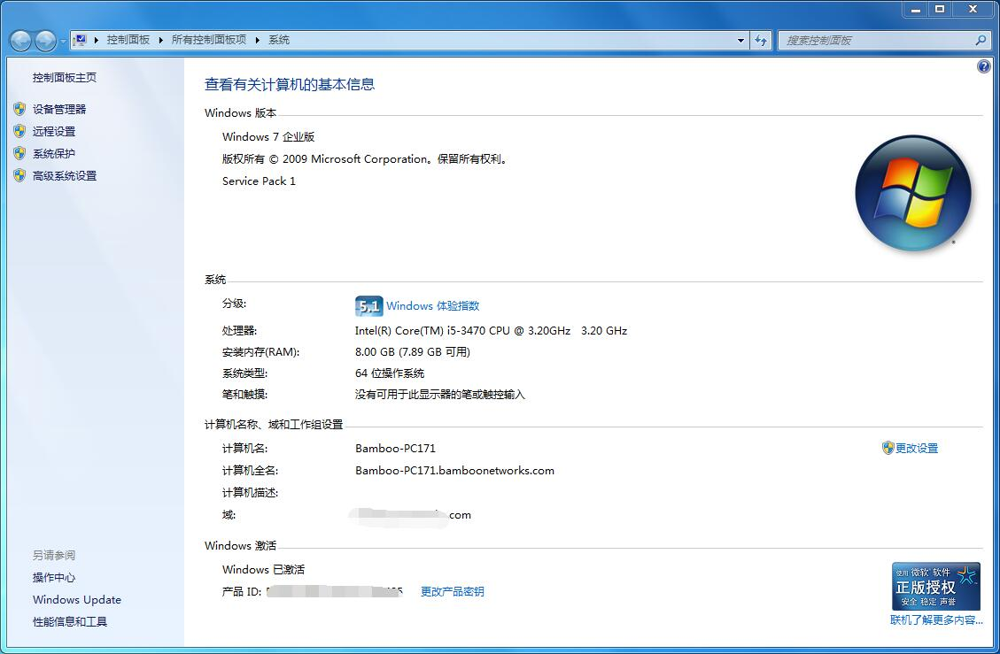
在“所有控制版面项”选择“程序与功能”。
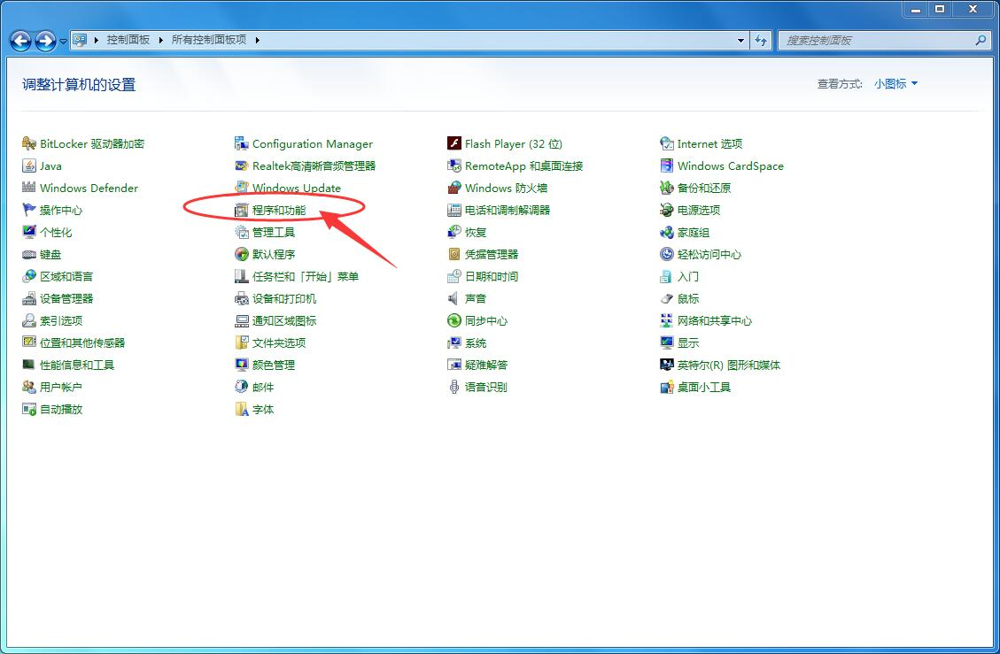

## Step2 打开Windows功能选项
选择左上方的“打开或关闭Windows功能”。
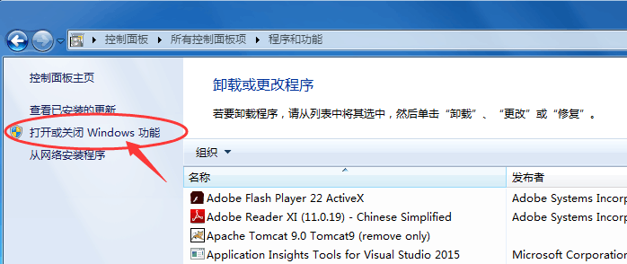

## Step3 勾选Internet信息服务
展开“Internet信息服务”选项，根据你需要的来打钩，如果你不知道具体需要勾选哪些，可以全部都打钩。
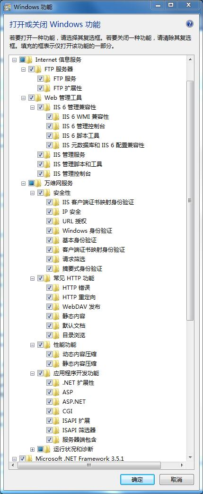
勾选完后，点击确定，等待安装，可能需要好几分钟，给点耐心吧。
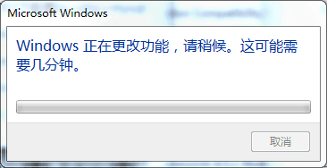
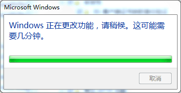
安装完成之后，打开控制面板，双击“管理工具”，选择“Internet信息服务(IIS)管理器”，管理界面如下所示。
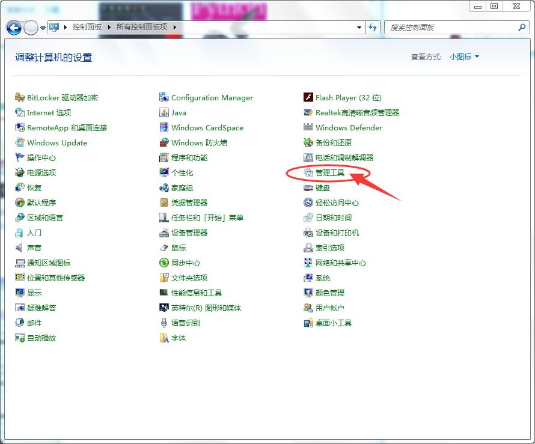
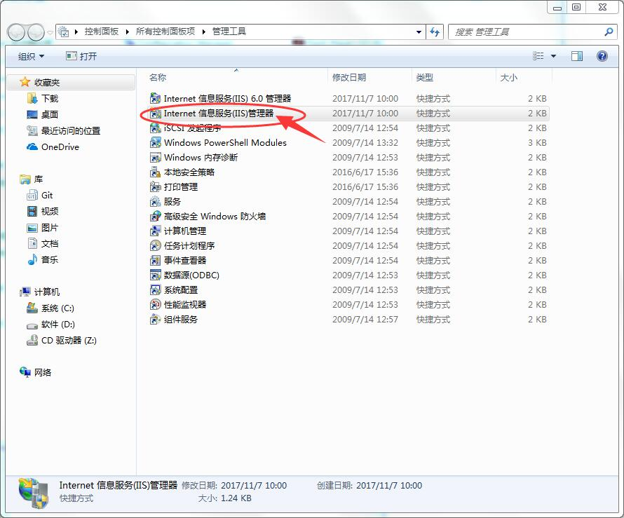
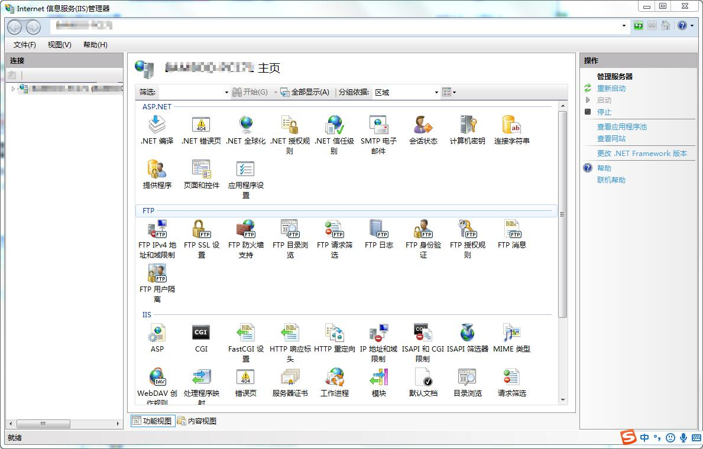
打开计算机，进入C盘，可以发现C盘根目录里面多了一个叫inetpub的文件夹。
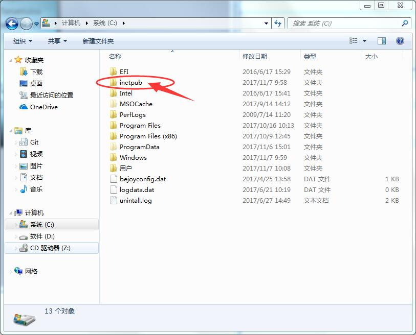

## Step4 验证安装是否成功
打开浏览器，输入localhost，回车，显示如下，说明IIS已经安装成功。
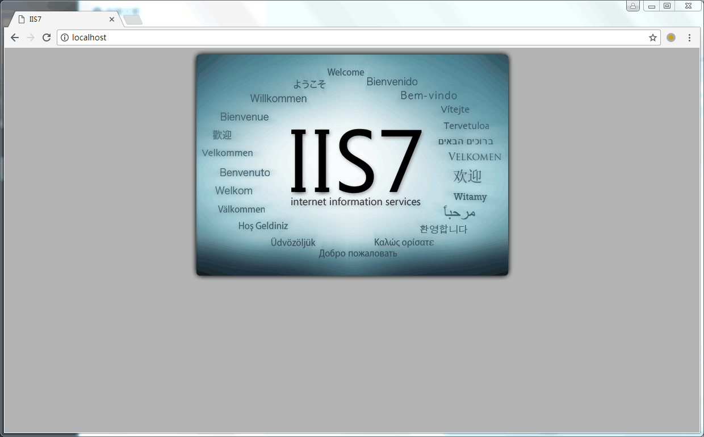