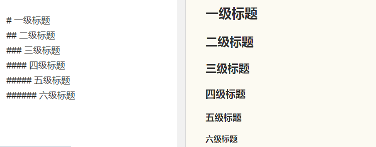
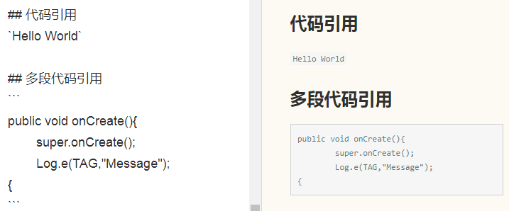

Markdown是一种电子风格的标记语言，它能让写作者关注于写作内容本身，而不是文章的排版。平时使用Github的朋友会发现每个项目都会有一个后缀名为.md的文件，那就是Markdown格式写的文本文件。除了GitHub，还有很多地方都会使用到Markdown，如简书，Hexo。我是在使用简书的时候才开始接触Markdown并且深深地爱上了这种简洁的标记语言，在此推荐给大家。<!--more--> 

## 标题
这是最为常用的格式，在平时常用的的文本编辑器中大多是这样实现的：输入文本、选中文本、设置标题格式。而在Markdown中，你只需要在文本前面加上#即可，要注意的是，#和标题之间需要有空格隔开，否则hexo识别不出来的哦。
```
# 一级标题
## 二级标题
### 三级标题
#### 四级标题
##### 五级标题
###### 六级标题
```


## 代码
对于我们程序员来说最喜欢的莫过于代码的分享和交流啦，在Markdown里有两种标志代码的方式，单行代码可以用\`将代码句子包起来，多行代码可以在代码最前一行和最后一行加上三个\`，感觉很难描述清楚，没关系，大家直接看下面的图吧。


## 图片
图片的引用是![图片名字（可以不填）]后面加上用小括号括着的图片链接。
```

```


## 链接
链接的引用跟图片的引用很像，只是比图片引用少了前面的感叹号"!"。
```
欢迎关注我的简书[Liangmp](http://www.jianshu.com/u/fd9fbe96c3c2)
```
欢迎关注我的简书[Liangmp](http://www.jianshu.com/u/fd9fbe96c3c2)

## 分割线/分隔线
有时候文章里面需要用到分割线来分隔不同的部分，分割线的使用很简单，只需输入连续三个短破折号\-或者三个星号\*独立一行即可。

以上仅介绍了一些常用的Markdown语法，感兴趣的小伙伴可以看看这篇更为详细的[Markdown语法说明](http://wowubuntu.com/markdown/)