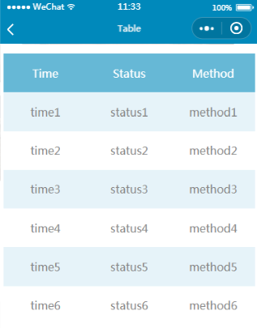

微信小程序是一种无须下载安装、不占用手机内存、仿传统app、依赖微信平台的轻量级app。相信对接触过网页开发的同学来说，开发微信小程序简直就是小case。微信小程序的开发在很大程度上借鉴（或者说继承）了html的开发模式，然而还是有不少细节上的不同，毕竟微信小程序是专门为移动端微信用户开发设计的。有很多html有的标签微信小程序是没有的，比如html的table tag，那么如何在微信小程序中做出表格样式呢？以下是我的尝试，供大家参考。<!--more-->

table.wxml
```html
<!--table.wxml-->
<view class="table">
  <view class="tr bg-w">
    <view class="th">Time</view>
    <view class="th">Status</view>
    <view class="th ">Method</view>
  </view>
  <block wx:for="{{listData}}" wx:key="{{time}}">
    <view class="tr bg-g" wx:if="{{index % 2 == 0}}">
      <view class="td">{{item.time}}</view>
      <view class="td">{{item.status}}</view>
      <view class="td">{{item.method}}</view>
    </view>
    <view class="tr" wx:else>
      <view class="td">{{item.time}}</view>
      <view class="td">{{item.status}}</view>
      <view class="td">{{item.method}}</view>
    </view>
  </block>
</view>
```

table.wxss
```css
/*table.wxss*/
.table {
  border: 0px solid darkgray;
  padding: 20rpx 10rpx;
}
.tr {
  display: flex;
  width: 100%;
  justify-content: center;
  height: 3rem;
  align-items: center;
}
.td {
    width:50%;
    justify-content: center;
    text-align: center;
}
.bg-w{
  background: #0089dd;
  opacity: 0.6;
}
.bg-g{
  background: #E6F3F9;
}
.th {
  width: 50%;
  justify-content: center;
  background: #0089bb;
  color: #fff;
  display: flex;
  height: 3rem;
  align-items: center;
}
```

table.js
```
//table.js
Page({
  data:{
    listData: [
        { "time": "time1", "status": "status1", "method": "method1" },
        { "time": "time2", "status": "status2", "method": "method2" },
        { "time": "time3", "status": "status3", "method": "method3" },
        { "time": "time4", "status": "status4", "method": "method4" },
        { "time": "time5", "status": "status5", "method": "method5" },
        { "time": "time6", "status": "status6", "method": "method6" }
      ]
  },
  onLoad: function () {
    console.log('onLoad')
  },
  onShow(){
  }
})
```

table.json
```json
{
  "navigationBarTitleText": "Table"
}
```

小程序页面效果如下：
