相信聪明的你照着上一篇文章的描述，已经成功搭建起了属于你自己的博客，但是hexo默认的主题风格是比较少的，在这里推荐next主题，[本博客](https://taylorliang.github.io)就是使用了next主题。下面来详细介绍next的安装和配置。<!--more-->

## next安装
安装next主题想当简单，只需要将含有next所需文档的文件夹放置在你的本地博客目录下的themes文件夹里面即可。
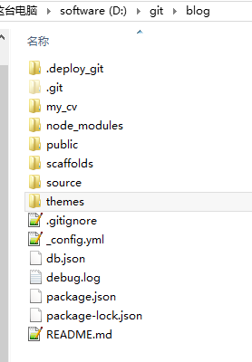

首先需要从[Github](https://github.com/iissnan/hexo-theme-next)上将next主题clone下来，在blog目录下右击git bash here，然后输入命令行：
`git clone https://github.com/iissnan/hexo-theme-next themes/next`

## 使用next主题
拉完代码后打开hexo的配置文件_config.yml，将theme改成next，需要注意的是，`theme:`和`next`之间是有一个空格隔开的。
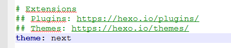

## 选择主题风格
打开next文件夹下的配置文件_config.yml（没错，确实是跟hexo的配置文件同名了）,目前next有Muse, Mist, Pisces和Gemini这四种风格的主题，我的博客用的是Pisces，你可以每个都尝试一下看你喜欢哪个。
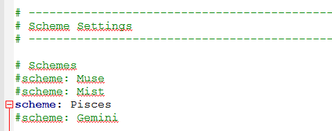

## 其他配置

### 网页标签icon修改
网页标签icon的存放地址为`\themes\next\source\images\` 将里面的相应图标修改成自己喜欢的图标即可，在此推荐[阿里巴巴矢量图标库](http://www.iconfont.cn/)，里面的icon非常丰富。

### footer页脚设置
这段代码用于设置footer页脚的显示，这里可以根据自己的喜好，将Icon between year and copyright info修改成`icon: heart`
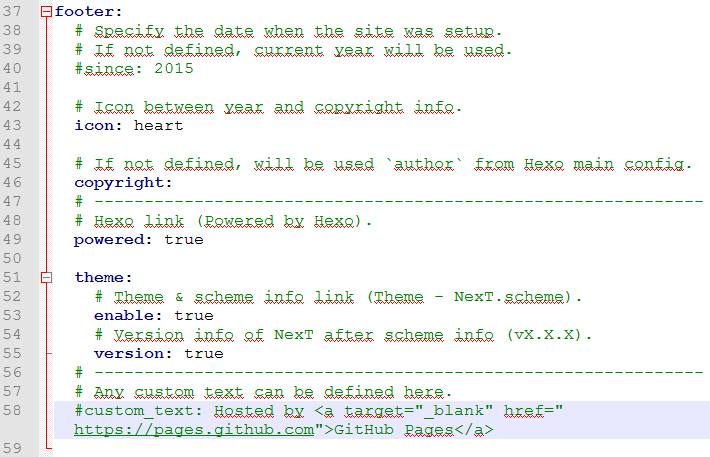

### menu菜单设置
添加tags，categories和about，修改如下：
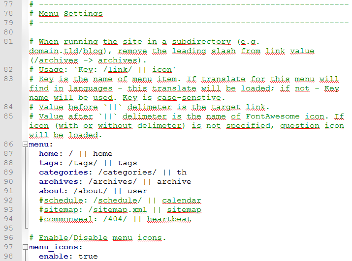
修改完配置文件后，需要在git bash输入以下命令行：
```
hexo hew page "tags" // 开启tags功能，将会在source文件夹下自动新建名为tags的文件夹
hexo hew page "categories" // 开启categories功能，将会在source文件夹下自动新建名为categories的文件夹
hexo hew page "about" // 开启about功能，将会在source文件夹下自动新建名为about的文件夹
```
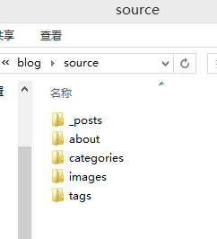

### 文章设置
在post_meta里可以设置显示文章的创建日期，修改日期，所属分类等信息。


### 代码显示风格
一共有normal，night，night eighties，night blue和night bright这五种代码显示风格，其中normal是白色底色的，如果你想装一下比，可以调成黑色。
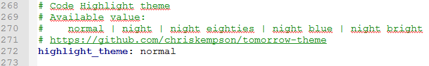

### 博客访问量统计
有多种博客访问量统计的方法，这里介绍其中一种非常简便的方法，叫busuanzi，修改代码如下：
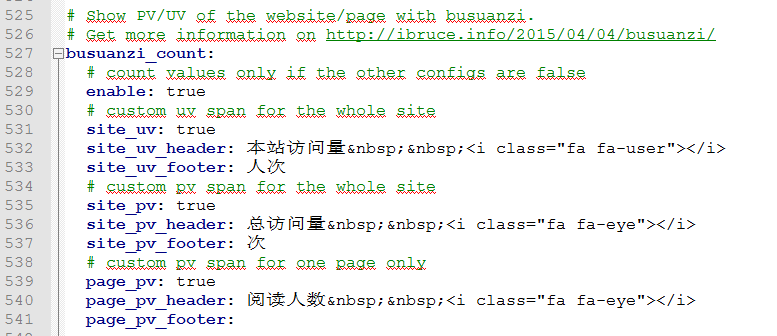

### 开通博客留言功能
开通留言功能有很多种途径，这里介绍其中一种，叫livere，方法非常简单，先在[livere](https://livere.com/)注册一个账户，打开官网，切换到安装页面，选择city版，点“现在安装”。
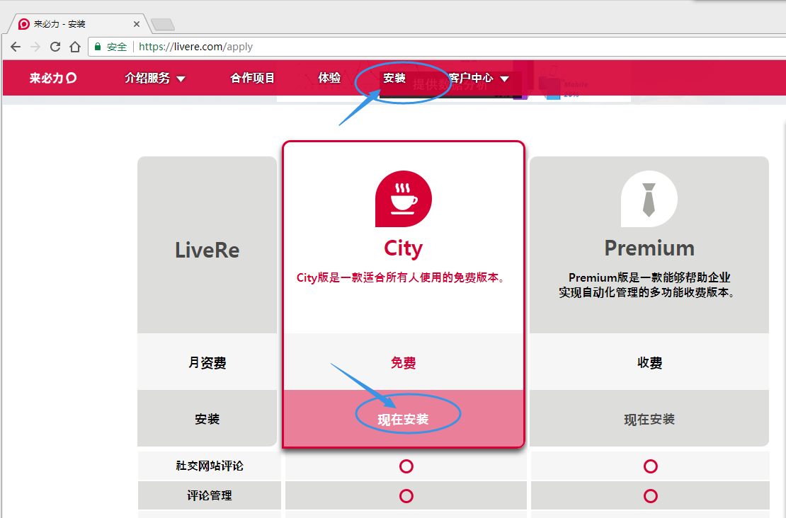
设置名称及URL：
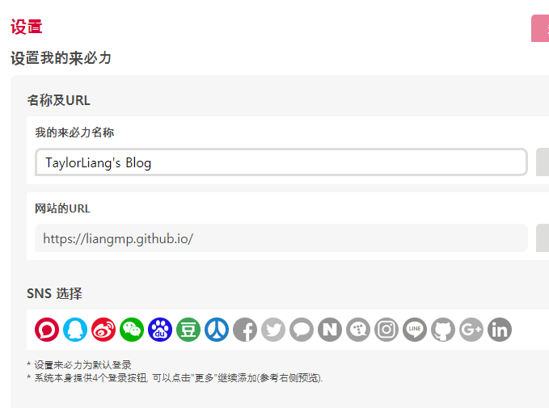
完成后会得到这么一串代码，将里面的data-uid复制到next的_config.yml里面的相应位置。
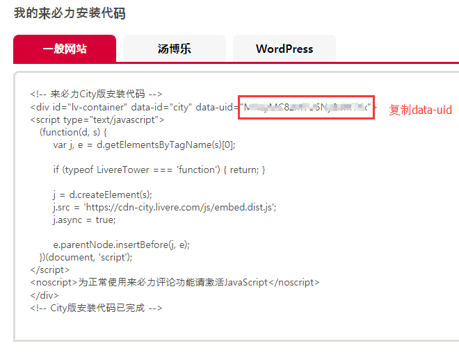
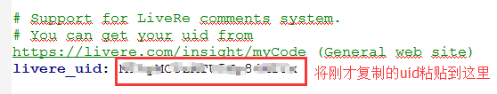

next提供了大量的个性化配置选项，你想要的功能大部分够可以在next的yml配置文件中找到，而且都有使用说明的注释，只要你认真阅读，肯定能挖掘出不少好玩的东西，在这里我就只介绍几个，剩下的留给聪明的你自己探索吧。

***
__致谢__
非常感谢[windliang](http://windliang.cc/)在知识星球_帅张和他的朋友们_给我的关于个人网站建设的回答,你的博客给予了我很大的帮助。

__友情链接__
[建立博客系列（三）：hexo安装配置](http://windliang.cc/2017/01/23/%E5%BB%BA%E7%AB%8B%E5%8D%9A%E5%AE%A2%E7%B3%BB%E5%88%97%EF%BC%88%E4%B8%89%EF%BC%89%EF%BC%9Ahexo%E5%AE%89%E8%A3%85%E9%85%8D%E7%BD%AE/)
[建立博客系列（四）：Next主题相关配置](http://windliang.cc/2017/01/28/%E5%BB%BA%E7%AB%8B%E5%8D%9A%E5%AE%A2%E7%B3%BB%E5%88%97%EF%BC%88%E5%9B%9B%EF%BC%89%EF%BC%9ANext%E4%B8%BB%E9%A2%98%E7%9B%B8%E5%85%B3%E9%85%8D%E7%BD%AE/)
[打造个性超赞博客Hexo+NexT+GithubPages的超深度优化](https://reuixiy.github.io/technology/computer/computer-aided-art/2017/06/09/hexo-next-optimization.html)
[自定义网页样式布局](http://www.cduyzh.com/hexo-settings-3/)

__博客推荐__
[reuixiy](https://reuixiy.github.io/)
[windliang](http://windliang.cc/)
[ookamiAntD's Blog](http://yangbingdong.com/)
[DONGChuan](http://dongchuan.github.io/)
[Water Sister's Blog](http://www.cduyzh.com/)
[YAODONG WANG](http://captwang.info/)
[世靖的码场](https://blog.csdn.net/qdbszsj?t=1)
[Kelvin.Liang](https://kelvin.link/)