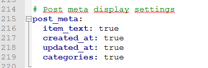

相信聪明的你照着上一篇文章的描述，已经成功搭建起了属于你自己的博客，但是hexo默认的主题风格是比较少的，在这里推荐next主题，[本博客](https://taylorliang.github.io)就是使用了next主题。下面来详细介绍next的安装和配置。<!--more-->

## next安装
安装next主题想当简单，只需要将含有next所需文档的文件夹放置在你的本地博客目录下的themes文件夹里面即可。


首先需要从[Github](https://github.com/iissnan/hexo-theme-next)上将next主题clone下来，在blog目录下右击git bash here，然后输入命令行：
`git clone https://github.com/iissnan/hexo-theme-next themes/next`

## 使用next主题
拉完代码后打开hexo的配置文件_config.yml，将theme改成next，需要注意的是，`theme:`和`next`之间是有一个空格隔开的。


## 选择主题风格
打开next文件夹下的配置文件_config.yml（没错，确实是跟hexo的配置文件同名了）,目前next有Muse, Mist, Pisces和Gemini这四种风格的主题，我的博客用的是Pisces，你可以每个都尝试一下看你喜欢哪个。


## 其他配置

### footer页脚设置
这段代码用于设置footer页脚的显示，这里可以根据自己的喜好，将Icon between year and copyright info修改成`icon: heart`


### menu菜单设置
添加tags，categories和about，修改如下：

修改完配置文件后，需要在git bash输入以下命令行：
```
hexo hew page "tags" // 开启tags功能，将会在source文件夹下自动新建名为tags的文件夹
hexo hew page "categories" // 开启categories功能，将会在source文件夹下自动新建名为categories的文件夹
hexo hew page "about" // 开启about功能，将会在source文件夹下自动新建名为about的文件夹
```


### 文章设置
在post_meta里可以设置显示文章的创建日期，修改日期，所属分类等信息。


### 代码显示风格
一共有normal，night，night eighties，night blue和night bright这五种代码显示风格，其中normal是白色底色的，如果你想装一下比，可以调成黑色。


### 博客访问量统计
有多种博客访问量统计的方法，这里介绍其中一种非常简便的方法，叫busuanzi，修改代码如下：


### 开通博客留言功能
开通留言功能有很多种途径，这里介绍其中一种，叫livere，方法非常简单，先在[livere](https://livere.com/)注册一个账户，打开官网，切换到安装页面，选择city版，点“现在安装”。

设置名称及URL：

完成后会得到这么一串代码，将里面的data-uid复制到next的_config.yml里面的相应位置。


next提供了大量的个性化配置选项，你想要的功能大部分够可以在next的yml配置文件中找到，而且都有使用说明的注释，只要你认真阅读，肯定能挖掘出不少好玩的东西，在这里我就只介绍几个，剩下的留给聪明的你自己探索吧。
