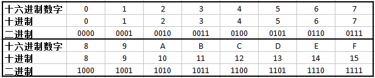
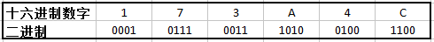
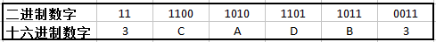

一个字节由8位组成。在二进制表示法中，它的值域是00000000(2)~11111111(2)；如果用十进制整数表示，它的值域就是0(10)~255(10)。两种表示法对于描述位模式来说都不是很方便，二进制表示法十分冗长，而十进制表示法与位模式的相互转化又非常麻烦。替代的方法是，以16位为基数，或者叫十六进制（hexadecimal）数，来表示位模式。十六进制（简写成“hex”）使用数字‘0’~‘9’以及字符‘A’~‘F’来表示16个可能的值。下图展示了16个十六进制数字对应的十进制值和二进制值。用十六进制书写，一个字节的值域为00(16)~FF(16)。<!--more-->

在C语言中，以0x或者0X开头的数字常量被认为是十六进制的值。字符‘A’~‘F’既可以是大写，也可以是小写，甚至是大小写混合。

编写机器级程序的一个很常见的任务就是在位模式的十进制、二进制和十六进制表示之间进行人工转换。

# 十六进制转二进制
二进制与十六进制之间的转换较为简单直接，因为可以一次执行一个十六进制数字的转换。一个简单的窍门是，记住十六进制数字A、C、F相对应的十进制值。而对于把十六进制值B、D、E转换成十进制值时，可以通过计算它们与前三个值的相对关系来完成。

例如，0x173A4C，转换成二进制格式，如下所示：

于是就得到了二进制表示：0001 0111 0011 1010 0100 1100

# 二进制转十六进制
如果给定一个二进制数字1111001010110110110011，我们可以先把它分为每四位一组，再把它转换为十六进制。要注意的是，如果位的总数不是4的倍数，则需要在最左边补零来凑齐四位。

于是就得到了十六进制表示：0x3CADB3

Tips:
当值x是2的非负整数n次幂时，也就是x=2^n，我们可以很容易地将x写成十六进制的形式，只要记得x的二进制表示就是在1后面跟n个0，而十六进制数字0代表4个二进制的0。因此，当n表示成i+4j的形式（其中0<=i<=3)时，我们可以把x写成开头的十六进制数字为1(i=0)、2(i=1)、4(i=2)或者8(i=3)，后面跟随j个十六进制的0。例如x=2048=2^11，即n=3+4*2，因此得到十六进制表示0x800，又如2^16表示成十六进制为0x10000，2^7表示成十六进制为0x80

# 十进制转十六进制
将十进制数x转换成十六进制，可以反复地用16除x（也就是x除以16啦），得到一个商q和一个余数r，也就是`x=q*16+r`，然后用十六进制表示的r作为最低位数字（也就是最右边的位数），重复以上操作直至商为零。举个栗子，十进制数314156转换为十六进制：

|x=q*16+r|最低位数字(十六进制表示)|
|:--:|:--:|
|314156 = 19634*16 + 12|C|
|19634 = 1227*16 + 2|2|
|1227 = 76*16 + 11|B|
|76 = 4*16 + 12|C|
|4 = 0*16 + 4|4|

因此十进制数314156表示成十六进制为0xC2BC4

十进制转二进制方法同上。

# 十六进制转十进制
用相应的16的幂乘以每个十六进制数字。比如0x7AF，计算十进制的过程为`7*16^2 + 10*16^1 + 15*16^0 = 1967`。

二进制转十进制方法同上。
