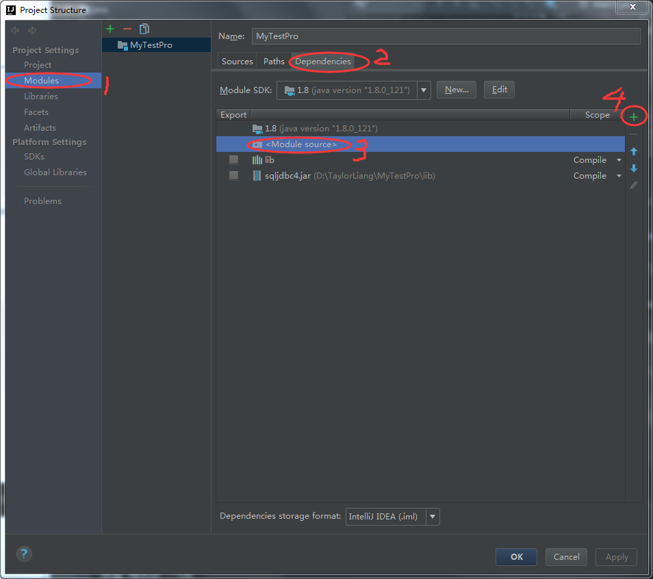
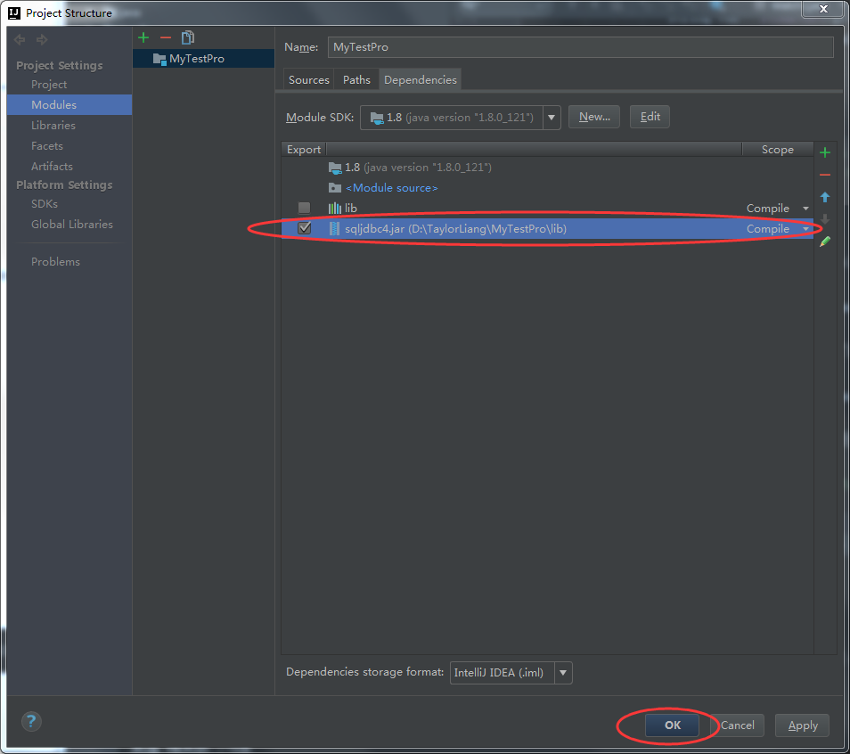

原材料：sqljdbc4.jar
数据库：SQL Server
代码编辑工具：IntelliJ IDEA<!--more-->
***

## 实现步骤：
### 1. 下载java包：[sqljdbc4.jar](http://www.csdn.net/tag/sqljdbc4.jar/download)
### 2. 在IntelliJ当前项目中手动导入Java包
IntelliJ idea添加jar包
把上一步下载好的jar包放到项目的lib目录文件夹下，但是在IDEA里面的目录树lib里并没有看见sqljdbc4.jar，因此需要手动导入jar包。
File > Project Structure.. > 选Project Settings下面的Modules > Dependencies > 选<Module source> > 点击右边的+号 > 选jar包

选择好jar包之后会发现这里多了sqljdbc4.jar，选中，点击确定键，即可成功导入。回到项目工作区，在左侧的项目树可以看到sqljdbc4.jar已经在lib下面了。



### 3. 在数据库中创建用于查询的表格
数据库表格创建在这里就不说了。

### 4. 代码实现
```java
import java.sql.*;
import java.lang.Class;

public class SQLHanlder {

	static Connection connection = null;
	static Statement statement = null;
	static ResultSet resultset = null;
	
	// 连接登录数据库的函数
	private static void connect(String server, String databaseName, String userName, String password) {
		databaseName = databaseName.toUpperCase().trim();

		/************** 若要更改数据库连接，请在此设置 **************/
		String url = "jdbc:sqlserver://" + server + ":8080;DatabaseName=" + databaseName;  // 8080为端口号，根据需要修改

		try {
			connection = DriverManager.getConnection(url, userName, password);
			DriverManager.setLoginTimeout(30);

		} catch (SQLTimeoutException e) {
			e.printStackTrace();
		} catch (SQLException e) {
			e.printStackTrace();
		} catch (Exception e) {
			e.printStackTrace();
		}
	}
	
	
	// 查询数据库并且返回数据
	public static void SqlSelect(String databaseName, String tableName, String queryCondition){
		String server = "localhost";    // 改成你的数据库的地址
		String userName = "username";   // 改成你的数据库的username
		String password = "password";   // 改成你的数据库的password
		databaseName = databaseName.toUpperCase().trim();
		String strSQL = "SELECT" + " * " + "FROM [" + databaseName + "].[dbo].[" + tableName + "]" + " where " + queryCondition;
		System.out.println(">>> Connecting to SQL database, please wait...");

		try {
			// 第一步：注册JDBC驱动程序
			Class.forName("com.microsoft.sqlserver.jdbc.SQLServerDriver");
			System.out.println(">>> JDBC driver has been singed up successfully.");

			// 第二步：连接到数据库
			SQLHanlder.connect(server, databaseName, userName, password);   // 调用登录数据库函数
			System.out.println(">>> Connection has been built up successfully.");

			// 第三步：利用上面创建的语句对象句柄，对数据库进行操作
			statement = connection.createStatement();
			statement.setQueryTimeout(30);

			// 第四步：利用上面创建的语句对象句柄，对数据库进行操作
			resultset = statement.executeQuery(strSQL);
			System.out.println(">>> Executing query: " + strSQL);

			ResultSetMetaData rsmd = resultset.getMetaData(); // 存放数据

			// 第五步：遍历数据并且打印到屏幕
			int getColumns = rsmd.getColumnCount();
			while (resultset.next()) {
				for (int i = 0; i < getColumns; i++) {
					String val = resultset.getString(i + 1);
					System.out.println(val);     // 打印出查询结果
				}
			}

			resultset.close(); // 关闭记录集
			statement.close(); // 关闭语句对象句柄
			connection.close(); // 关闭数据库连接
			System.out.println(">>> SQL database connection is closed.");

		} catch (SQLException e) {
			e.printStackTrace();
		} catch (Exception e) {
			e.printStackTrace();
		}

		System.out.println(" ==== SQL selection is done ==== ");
	}
	
	public static void main(String[] args){   // 主函数，用于测试数据库连接和查询功能
		
		String databaseName = "databaseName"; // 数据库名称
		String tableName = "table";			  // 表格名称
		String queryCondition = "id = 1039";  // 查询条件
		SqlSelect(databaseName,tableName,queryCondition);
	}
	
}
```