Java Web 开发有三大框架，分别是Struts, Spring, 和Hibernate. Struts2是Struts的下一代产品，是一个基于MVC架构的框架。书上讲了一大堆关于Struts2框架的理论性的东西，看得我似懂非懂的，本人还是坚持理论需要跟实践结合，因此有必要亲自动手体验一番Struts2. 刚开始是用 IntelliJ 作为 IDE 来写一个 Struts2 简单小项目的，但是用 IntelliJ 跑会报 Artifact 错误，解决起来很麻烦，于是干脆换 Eclipse JavaEE 来跑。本文基于Eclipse Java EE IDE和Struts2.5写一个简单的登录系统。<!--more-->

# 下载并安装 Eclipse Java EE
在[Eclipse官网](http://www.eclipse.org/downloads/eclipse-packages/)下载Eclipse IDE for Java EE Developers.
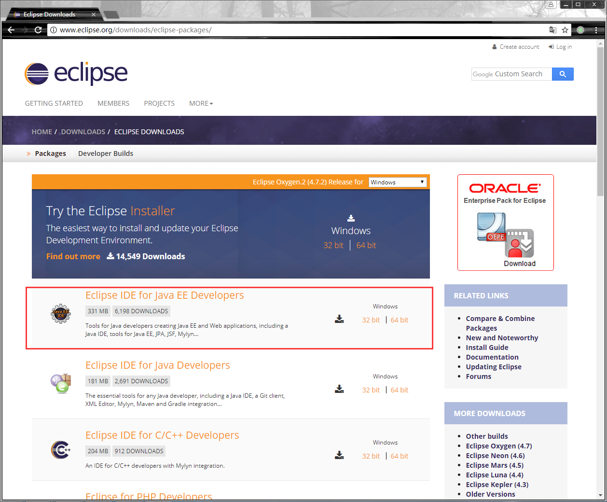，安装很简单，除了路径设置，一路next就ok。

# 下载Strut2
在[Struts官网](http://struts.apache.org/download.cgi)下载最新版本的Struts，我下载的是Struts 2.5.14.1
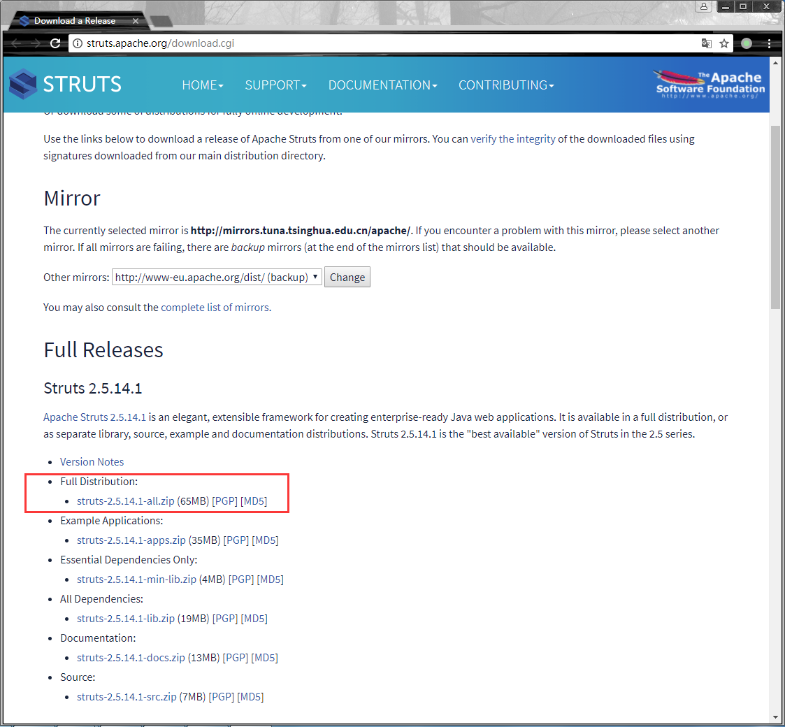

# 创建Struts2 Project
Eclipse Java EE安装成功后Create new Java EE Web Project.

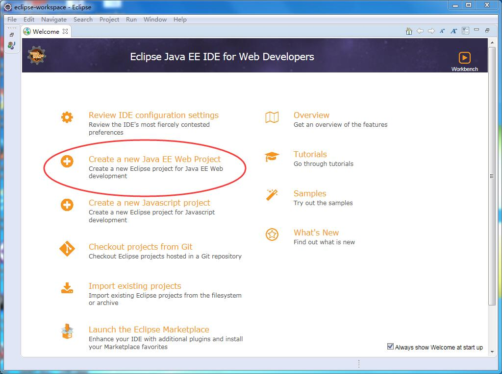

进入到New Dynamic Web Project窗口界面，给Project命名（如struts2test)，在Target runtime选项中选择New Runtime，选Tomcat（如果没有安装Tomcat需要先安装，安装方式请见我之前的博客文章[Tomcat部署](https://liangmp.github.io/2017/10/24/Tomcat/)）

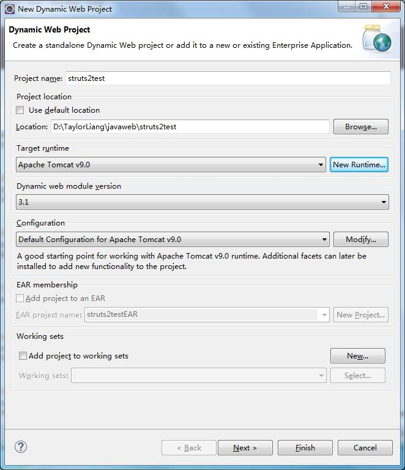

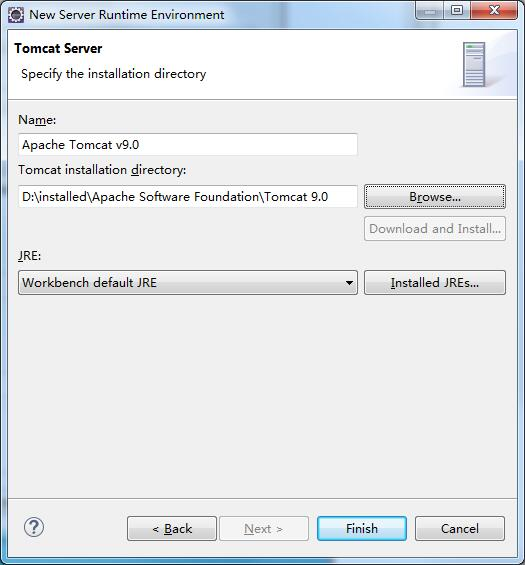

# 添加struts2 jar包
解压下载下来的struts-2.5.14.1-all.zip压缩包，将`~\struts-2.5.14.1\lib`里面需要用到的jar包放到项目里面，路径为`~\struts2test\WebContent\WEB-INF\lib`，如果你不知道需要用什么jar包，可以按我的jar包列表复制过去。
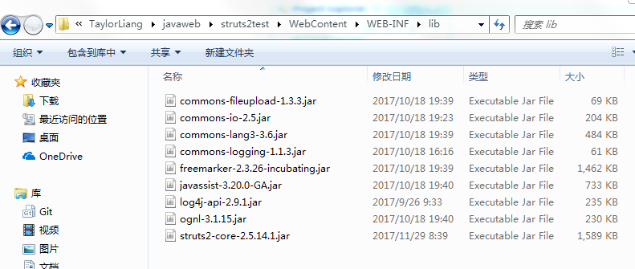
jar包放到项目里面后，在eclipse里面显示如下：
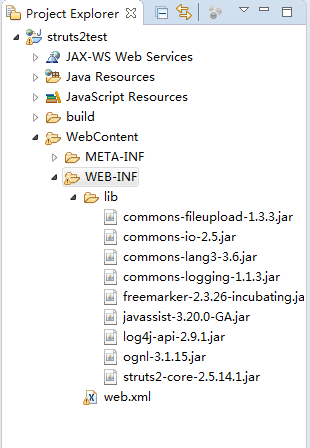

# 创建Action类
在src目录下new一个package（其实就是一个文件夹），命名为struts.devMode，在里面new一个class，命名为LoginAction.java
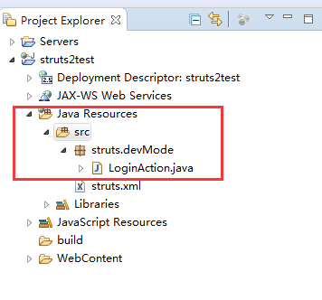

LoginAction.java代码如下：
```java
package struts.devMode;

public class LoginAction{
	
       private String name;
       private String password;
       
       public String execute() throws Exception {
    	   if (getPassword().equals("123456")) {
    		   return "success";
    	   } else {
    		   return "error";
    	   }
       } 
       public String backToIndex() throws Exception {
    	   return "index";
       }
       public String getName() {
           return name;
       }
       public void setName(String name) {
           this.name = name;
       }
       public String getPassword() {
    	   return password;
       }
       public void setPassword(String password) {
    	   this.password = password;
       }
}
```

# 创建视图页面
在WebContent目录下创建以下3个jsp文件。在这里做一个简单的登录系统，只有三个页面：登录主页面，登录成功页面，登录失败页面。
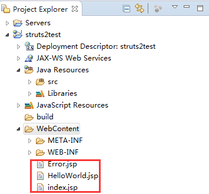

<b>index.jsp</b>
```jsp
<%@ page language="java" contentType="text/html; charset=ISO-8859-1"
   pageEncoding="ISO-8859-1"%>
<%@ taglib prefix="s" uri="/struts-tags"%>
   <!DOCTYPE html PUBLIC "-//W3C//DTD HTML 4.01 Transitional//EN" 
"http://www.w3.org/TR/html4/loose.dtd">
<html>
<head>
<title>Hello World</title>
</head>
<body>
   <h1>Hello World in WEB-INF</h1>
   <form action="hello">
      <label for="name">Please enter your username and password</label><br/><br/>
      <label> username </label>&nbsp;
      <input type="text" name="name"/><br/><br/>
      <label> password </label>&nbsp;
      <input type="password" name="password"/><br/><br/>
      <input type="submit" value="Login"/>
   </form>
</body>
</html>
```

<b>HelloWorld.jsp</b>
```jsp
<%@ taglib prefix="s" uri="/struts-tags"%>
<%@ page contentType="text/html; charset=UTF-8"%>
<html>
    <head>
        <title>Login successfully</title>
    </head>
    <body>
        Hello <s:property value="name"/>, login successfully. <br/>
        <form action="back">
        	<br/><br/><input type="submit" value="BACK">
        </form>
    </body>
</html>
```

<b>Error.jsp</b>
```jsp
<%@ taglib prefix="s" uri="/struts-tags"%>
<%@ page contentType="text/html; charset=UTF-8"%>
<html>
    <head>
        <title>Login Failed</title>
    </head>
    <body>
        Sorry <s:property value="name"/>, login failed, please try again.<br/>
        <form action="back">
        	<br/><br/><input type="submit" value="BACK">
        </form>
    </body>
```

# 添加配置文件
## 添加struts.xml
在src目录下添加struts.xml配置文件
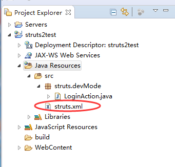
struts.xml代码内容如下：
```xml
<?xml version="1.0" encoding="UTF-8" ?>
<!DOCTYPE struts PUBLIC
    "-//Apache Software Foundation//DTD Struts Configuration 2.5//EN"
    "http://struts.apache.org/dtds/struts-2.5.dtd">
    
<struts>
   <package name="struts.devMode" extends="struts-default">     
      <action name="hello" class="struts.devMode.LoginAction" method="execute">
      		<result name="success">/HelloWorld.jsp</result>
      		<result name="error">/Error.jsp</result>
      </action>
      <action name="back" class="struts.devMode.LoginAction" method="backToIndex">
      		<result name="index">/index.jsp</result>
      </action>
   </package>
</struts>
```

## 添加web.xml
在`WebContent/WEB-INF`下创建web.xml文件
![struts2/web.png]
web.xml代码内容如下：
```xml
<?xml version="1.0" encoding="UTF-8"?>
<web-app id="WebApp_9" version="2.4" 
    xmlns="http://java.sun.com/xml/ns/j2ee" 
    xmlns:xsi="http://www.w3.org/2001/XMLSchema-instance" 
    xsi:schemaLocation="http://java.sun.com/xml/ns/j2ee http://java.sun.com/xml/ns/j2ee/web-app_2_4.xsd">
    
   <display-name>Struts 2</display-name>
   <welcome-file-list>
      <welcome-file>index.jsp</welcome-file>
   </welcome-file-list>
   <filter>
        <filter-name>struts2</filter-name>
        <filter-class>org.apache.struts2.dispatcher.filter.StrutsPrepareAndExecuteFilter</filter-class>
   </filter>
   <filter-mapping>
      <filter-name>struts2</filter-name>
      <url-pattern>/*</url-pattern>
   </filter-mapping>
</web-app>
```

# 运行程序
右键Project->Run As->Run on Server
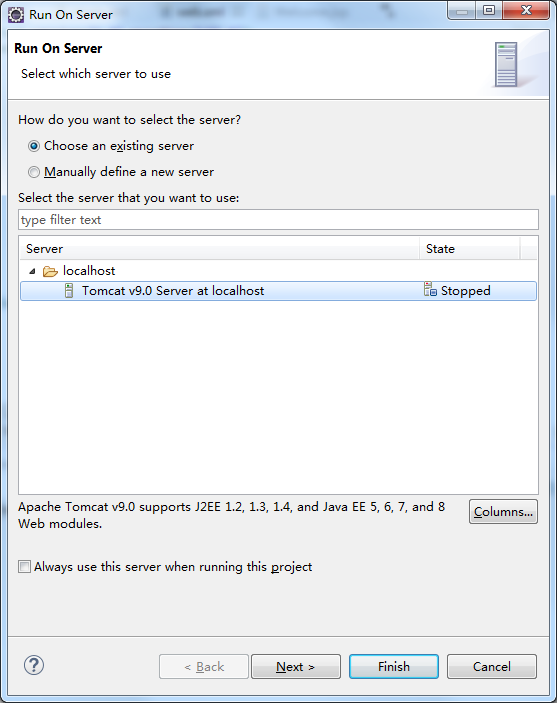
点击Finish，在Tomcat服务器上运行程序，运行界面如下，首先在index.jsp界面，要求输入用户名和密码，用户名可以随便输入，密码为123456（密码在LoginAction.java中已设置）,当用户名输入Taylor, 密码输入123456时，跳转到HelloWorld页面，如果密码输入错误，则进入到Error页面，点击Back按钮可以回到index页面。

<b>index页面：</b>
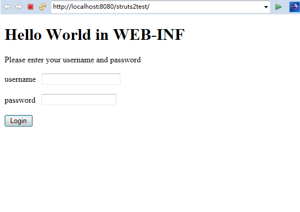

<b>登录成功页面：</b>
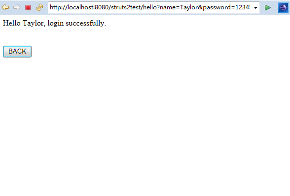

<b>登录失败页面：</b>
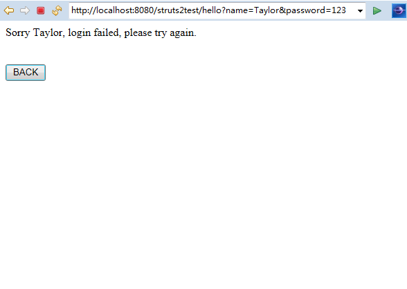

# 部署到Tomcat
右键Project->Export->WAR file
将生成的 WAR file 放到Tomcat的webapp目录下，运行Tomcat，在浏览器地址栏输入http://localhost:8080/struts2test 即可访问该程序。WAR file的部署方法适用于将写好的程序部署到服务器上。